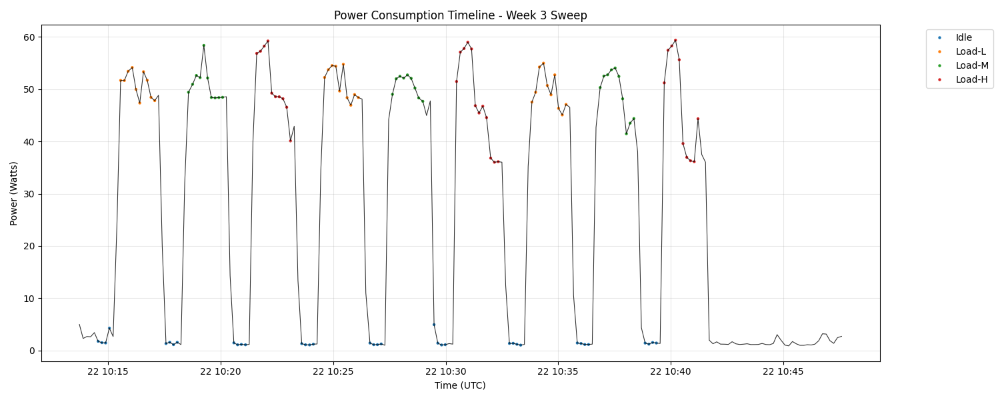
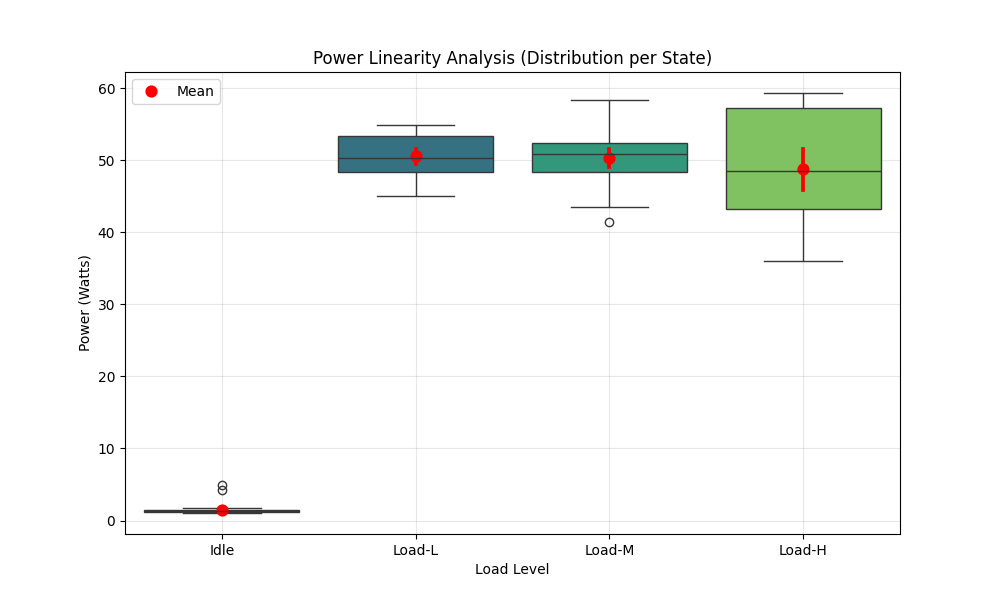
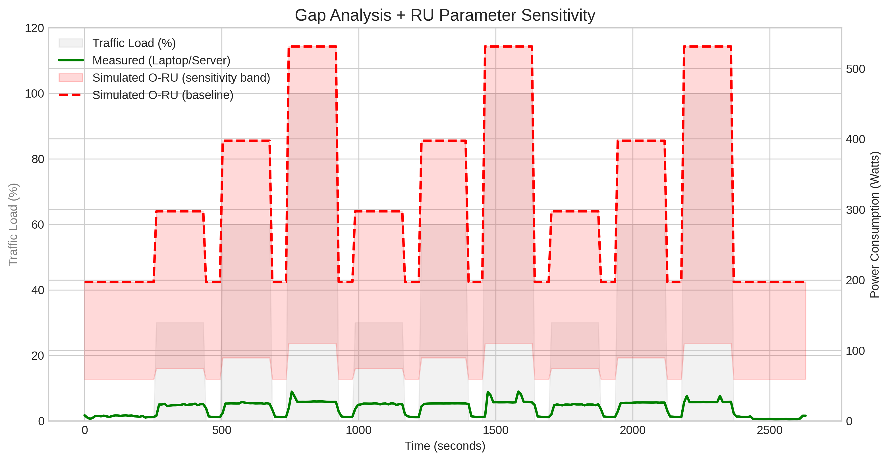
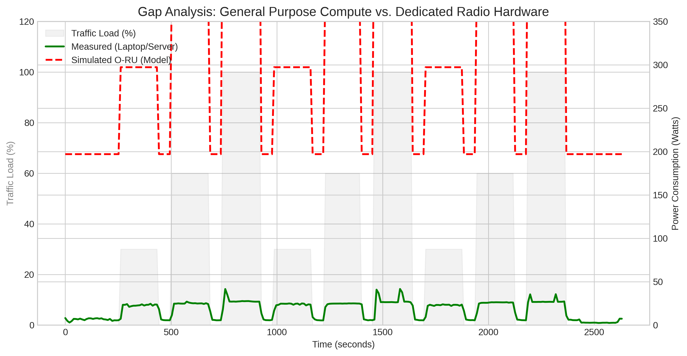
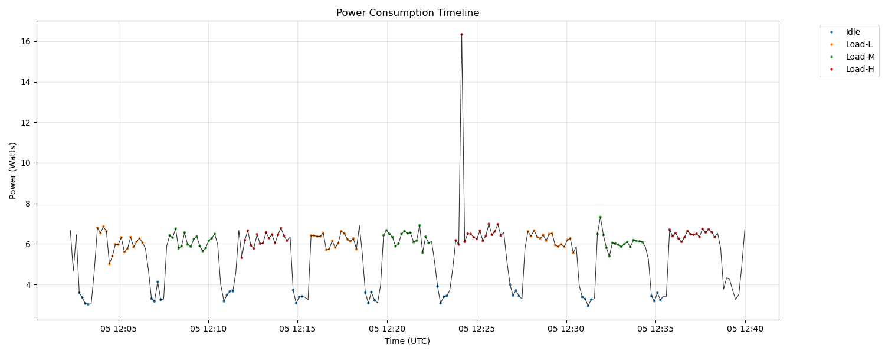
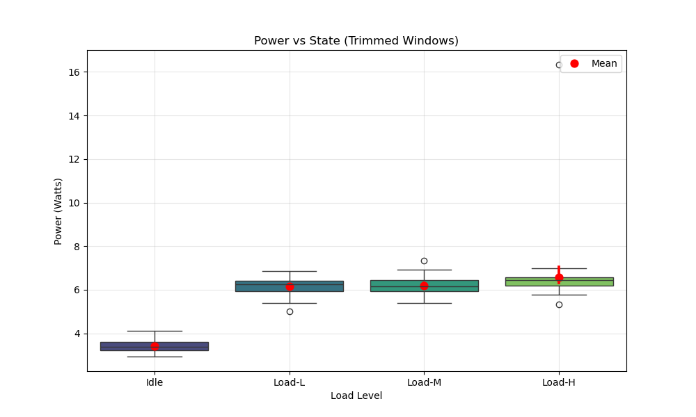

# Abstract
This work develops a **reproducible power-measurement methodology** for an O-RAN Radio Unit (O-RU), with an initial **software-first proxy** executed on a general-purpose Linux host. Because RU hardware and lab-grade instrumentation were not always available, we measure **platform power** using Intel/AMD RAPL energy counters exposed via Linux and collected by **Scaphandre**.

We define repeatable workload states (Idle, Active-Idle, Load-L/M/H), synchronize scenario boundaries via explicit UTC markers, and compute power/energy statistics on **trimmed steady-state windows**. A multi-round sweep shows a strong Idle→Active step and a narrower active band across load levels. A “burst vs smooth” proxy experiment demonstrates that **race-to-sleep (TDM-style duty cycling)** can reduce average platform power by ~48% at iso-throughput, motivating scheduler-level future work.

**Scope note:** Reported power values are **platform power under RU-like workload**, not RU AC/DC input power.

# 1. Background and Goal
## 1.1 Problem statement
Energy consumption in RAN infrastructure is dominated by the base station and radio unit. To compare energy behavior across configurations and ultimately across vendors/hardware, we need a **measurement procedure** that is:
- repeatable (same scenario → same result within noise),
- traceable (clear measurement point, units, timestamps),
- reviewer-safe (explicit windowing, clear limitations).

## 1.2 Project goal
Establish a reproducible methodology that can be executed now (software proxy) and later transferred to hardware-grade RU input power measurement without changing the scenario structure.

# 2. Measurement Point and Metrics
## 2.1 Measurement point (software proxy)
- **Device under test (DUT):** General-purpose compute host running RU-like workload proxy.
- **Power instrument:** Scaphandre (Prometheus exporter) reading Linux RAPL counters.
- **Signal:** `scaph_host_power_microwatts` scraped at ~10 s cadence.

## 2.2 Metrics
We compute per-state metrics on steady-state windows:
- Average power: $P_{avg}$ (W)
- Energy: $E$ (J)
- Throughput: $T$ (Gbps)
- Efficiency (proxy): $\eta = T / P_{avg}$ (Gbps/W)

Energy is approximated from samples as:
$$
E \approx \sum_i P_i \Delta t
$$

# 3. Scenario Definition
## 3.1 States
- **Idle:** OS baseline, no traffic.
- **Active-Idle:** measurement/stack active, traffic off.
- **Load-L/M/H:** offered load steps (nominally 30% / 60% / 100%).

## 3.2 Run structure
To avoid boundary transients, we:
- record explicit `Start_*` / `Stop_*` markers in UTC,
- trim 10 s from the start and end of each marked segment,
- score only the trimmed windows.

# 4. Tooling and Data Formats
## 4.1 Toolchain
- Scaphandre (power estimator)
- iperf3 (traffic generation)
- Bash scripts for orchestration
- Python scripts for parsing/plotting

## 4.2 Artifact conventions
- Raw runs live under `runs/YYYY-MM-DD/...`
- Plots and summaries live under `assets/YYYY-MM-DD/plots/`

# 5. Experimental Results

## 5.1 Pilot: Power-enabled pipeline validation (2026-01-20)
A pilot run validated end-to-end logging, markers, and per-state scoring.

Table: Per-state summary (pilot)

| State | Mean Power (W) | Energy (J) | Duration (s) | Throughput (Gbps) | Efficiency (Gbps/W) |
|---|---:|---:|---:|---:|---:|
| Pure Idle | 1.023 | 91.6 | 100 |  |  |
| Active-Idle | 1.859 | 319.7 | 181 |  |  |
| Load-M | 37.631 | 10704.6 | 292 | 97.464 | 2.590 |

Source artifacts: `runs/2026-01-20/`.

## 5.2 Week 3: Load sweep statistics (2026-01-22)
A multi-state sweep (Idle + Load-L/M/H) demonstrates repeatability and the “step-function” behavior:

| State | Mean (W) | Std (W) | CV (%) |
|---|---:|---:|---:|
| Idle | 1.4920 | 0.7964 | 53.38 |
| Load-L | 50.5983 | 2.9533 | 5.84 |
| Load-M | 50.2996 | 3.4350 | 6.83 |
| Load-H | 48.8443 | 8.3225 | 17.04 |

Key observation: once traffic begins, platform power jumps from ~1–2 W to ~50 W, with only modest separation between L/M/H compared to the Idle→Active jump.

Supporting plots:
- Timeline: 
- Linearity: 

## 5.3 Week 4: Gap analysis vs RU anchor classes (2026-01-28)
We produced a publishable sensitivity plot and a gap overlay comparing the proxy power trace to modeled RU classes.

Key trimmed-window medians (proxy):
- Idle median: **5.696 W**
- Active median: **24.983 W**
- 30% load median: **23.353 W**
- 60% load median: **24.983 W**
- 100% load median: **26.926 W**

RU anchors used (P12-style classes):
- Micro RU: $P_{min}=59$ W, $P_{max}=110$ W
- Macro RU: $P_{min}=197$ W, $P_{max}=531$ W

Derived ratios (RU / proxy):
- $59/5.696 \approx 10.36\times$ (micro idle vs proxy idle)
- $197/5.696 \approx 34.59\times$ (macro idle vs proxy idle)

Figures:
- Sensitivity: 
- Gap overlay: 

## 5.4 Two-host sweep (Windows sink) (2026-02-05)
To increase credibility beyond localhost/loopback, we repeated the sweep with **two hosts**:
- **Measured host (Linux laptop):** power logging + iperf3 client
- **Sink (Windows PC):** iperf3 server

Artifacts:
- Run folder: `runs/2026-02-05/sweep-120233/`
- Stats table: `assets/2026-02-05/plots/stats_summary.md`
- Repeatability table: `assets/2026-02-05/plots/repeatability_per_run.md`
- Throughput table (client logs): `runs/2026-02-05/sweep-120233/iperf_client_summary.md`

Trimmed-window power summary:

| State | Mean (W) | Std (W) | CV (%) | Min (W) | Max (W) |
|---|---:|---:|---:|---:|---:|
| Idle | 3.4075 | 0.2798 | 8.21 | 2.9361 | 4.1295 |
| Load-L | 6.1682 | 0.3811 | 6.18 | 5.0077 | 6.8600 |
| Load-M | 6.1960 | 0.3657 | 5.90 | 5.3906 | 7.3279 |
| Load-H | 6.5841 | 1.4690 | 22.31 | 5.3178 | 16.3342 |

Notes:
- This run used **TCP mode** (best-effort). The L/M/H labels are nominal; achieved throughput depends on link capacity and TCP behavior.
- Offered throughput was **Wi‑Fi-limited** in this run; achieved receiver rates were ~51–61 Mbps across L/M/H.
- Load-H shows a high CV due to a single large spike (max 16.33 W) concentrated in Run 2; repeatability per-run statistics isolate this event.

Supporting plots:
- Timeline: 
- Linearity: 

## 5.5 Validation: Burst vs smooth at iso-throughput (2026-02-04)
We tested a “race-to-sleep” proxy using duty-cycled traffic.

| Phase | Duration (s) | Avg Power (W) |
|---|---:|---:|
| Idle baseline | 60.0 | 4.79 |
| Smooth (30%) | 180.0 | 21.78 |
| Burst (30% duty) | 180.2 | 11.25 |

Savings: $21.78 - 11.25 = 10.53$ W (48.4%).

# 6. Discussion
## 6.1 What the proxy can and cannot claim
This methodology reliably measures **platform power response** to workload state changes. It does not directly measure:
- RU power amplifier behavior,
- RU AC/DC input power,
- RF output power or EIRP.

## 6.2 Interpreting step-function behavior
The Week 3/4 sweeps suggest the platform enters a high-power operating regime as soon as sustained traffic begins (CPU frequency/uncore/NIC activity), after which incremental throughput changes do not strongly increase platform power.

## 6.3 Relation to prior work (context for the “gap”)
Our observations are consistent with the recurring theme in base-station power modeling literature: **static/offset power dominates at low load**, so efficiency gains require enabling real sleep states rather than only reducing utilization.

For an annotated literature bridge (working notes), see:
- “How Much Energy is Needed to Run a Wireless Network?” (E³F framework; static power issue)
- “Energy Efficiency Improvements through Micro Sites …” (offset power importance)
- “A Parameterized Base Station Power Model” (load/bandwidth/antenna parameterization)
- “Deploying Dense Networks for Maximal Energy Efficiency …” (circuit power dominance; multiplexing)

# 7. Limitations and Threats to Validity
- Software proxy only (no RU AC/DC input).
- Sampling cadence (~10 s) limits transient analysis.
- Loopback/localhost traffic can overemphasize CPU/network stack vs NIC/PHY behavior.
- Background OS tasks and CPU governor can bias the “active band.”

# 8. Data Quality and Acceptance Criteria (Proposed)
These criteria are chosen to be practical for an internship report while still being reviewer-safe.

## 8.1 Repeatability (power)
For each state (Idle, Active-Idle, Load-L/M/H), compute the coefficient of variation:
$$
CV = \frac{\sigma}{\mu} \times 100\%
$$

Proposed thresholds (steady-state, trimmed windows):
- Load states (L/M/H): target $CV \le 10\%$ (good), $CV \le 5\%$ (strong).
- Active-Idle: target $CV \le 10\%$.
- Idle: may exhibit higher CV due to low absolute power; accept if Idle is clearly separated from Active band and the windowing policy is consistent.

## 8.2 State separability (sanity)
- Ordering check (typical): $P_{idle} < P_{active} < P_{load}$.
- Practical check: state-to-state differences should be visually obvious in the timeline plot and supported by per-state statistics (mean/median).

# 9. Reproducibility (How to Run)
## 9.1 Prerequisites (Ubuntu / native Linux on the measured host)
- RAPL must be available (typically `/sys/class/powercap`).
- Scaphandre Prometheus exporter running and reachable at `http://localhost:8080/metrics`.
- `iperf3` installed.

Start Scaphandre (Docker example):

```bash
sudo docker run --rm --privileged --pid=host \
	-p 8080:8080 \
	-v /proc:/proc:ro \
	-v /sys:/sys:ro \
	hubblo/scaphandre prometheus --address 0.0.0.0 --port 8080
```

Start iperf3 server (same host for loopback experiments):

```bash
iperf3 -s
```

## 9.2 Two-host topology (recommended for credibility)
Use a separate sink host to avoid loopback artifacts.

- **Host A (Measured DUT, Ubuntu):** runs Scaphandre + the iperf3 client + the sweep scripts.
- **Host B (Traffic sink, Windows/WSL acceptable):** runs an iperf3 server.

Notes for Windows/WSL sink:
- Simplest: run `iperf3` server natively on Windows (better throughput, fewer networking surprises).
- If you run the server inside WSL2, inbound connections may require Windows port forwarding due to WSL2 NAT.

## 9.3 Week 4 sweep (gap analysis inputs)
This produces a new run folder containing `power_uw.txt`, `markers.csv`, and per-segment iperf logs.

```bash
./scripts/run_week4_gap_run.sh
```

Optional overrides (choose targets that match your link; e.g., 1 GbE cannot sustain `30G`):

```bash
TARGET_HOST=127.0.0.1 MODE=udp TARGET_L=30G TARGET_M=60G TARGET_H=90G \
OUTPUT_DIR=runs/$(date -u +%Y-%m-%d)/sweep-01 \
./scripts/run_week4_gap_run.sh
```

Analyze and generate plots/stat summaries:

```bash
python3 scripts/analyze_week3_data.py runs/2026-01-28/sweep-01
```

## 9.4 Burst experiment
Run:

```bash
./scripts/run_burst_experiment.sh
```

Notes:
- The run artifacts go under `runs/YYYY-MM-DD/burst-experiment/`.
- The analysis script currently reads `power_uw.txt` from the repository root (not from the run folder). If your power log is stored elsewhere, copy/symlink it to `./power_uw.txt` before running the analysis.

Analyze:

```bash
python3 scripts/analyze_burst_experiment.py
```

## 9.5 Export to PDF (optional)
If you have `pandoc` installed:

```bash
pandoc docs/FinalReport/00_Final_Report_Draft.md -o final_report.pdf
```

# 10. Conclusions
- A marker-aligned, trimmed-window procedure yields stable, reviewer-safe per-state power statistics.
- The proxy platform shows a strong Idle→Active jump and a narrower active band across L/M/H.
- Duty-cycled “bursting” reduces average platform power substantially at iso-throughput, motivating scheduler-level TDM approaches.

# 11. Future Work
- Hardware-in-loop measurement at RU input power (PDU/analyzer), preserving the same scenario states and marker policy.
- Multi-host (real NIC path) validation to reduce loopback artifacts.
- Scheduler modifications to create controllable idle gaps (TDM) and verify micro-sleep entry on RU hardware.

# 12. References

## Standards
- [S1] O-RAN.WG1.NESUC-R003-v02.00, "Network Energy Saving Use Cases Technical Report," O-RAN Alliance, Mar 2023.
- [S2] O-RAN.WG7.NES.0-R003-v03.0, "Network Energy Savings Procedures and Performance Metrics," O-RAN Alliance, 2024.
- [S3] O-RAN.WG4.TS.MP.0-R004-v19.00, "Management Plane Specification," O-RAN Alliance, 2024.
- [S4] O-RAN.SuFG.TR.NES-Analysis-R004-v01.01, "Energy Measurements Analysis Report," O-RAN Alliance SuFG, 2025.
- [S5] 3GPP TS 28.552 v18.5.0, "Management and orchestration; 5G performance measurements."
- [S6] ETSI ES 203 228 v1.4.1, "Environmental Engineering; Assessment of mobile network energy efficiency," Apr 2022.

## Literature
- [L1] X. Liang et al., "Enhancing Energy Efficiency in O-RAN Through Intelligent xApps Deployment," arXiv:2405.10116v1, May 2024. (Summary: `assets/2026-02-02/Paper1.md`)
- [L2] A. Wadud and N. Afraz, "RU Energy Modeling for O-RAN in ns3-oran," arXiv:2509.10978v1, Sep 2025. (Summary: `assets/2026-02-02/Paper2.md`)
- [L3] Paper 3 literature summary — `assets/2026-02-02/Paper3.md`
- [L4] Paper 4 literature summary — `assets/2026-02-02/Paper4.md`

## Internal (repo)
- Methodology, SOP, and results drafts: `docs/FinalReport/`
- Study notes and experiment logs: `docs/StudyNotes/`
- Raw artifacts: `runs/`; derived plots: `assets/`
- O-RAN Energy Saving Deep Dive: `docs/StudyNotes/2026-02-10_O-RAN-Energy-Saving-Deep-Dive.md`
