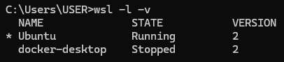
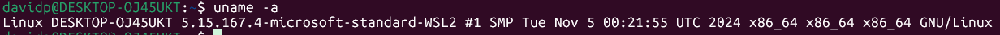
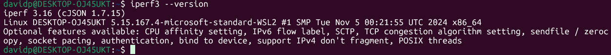
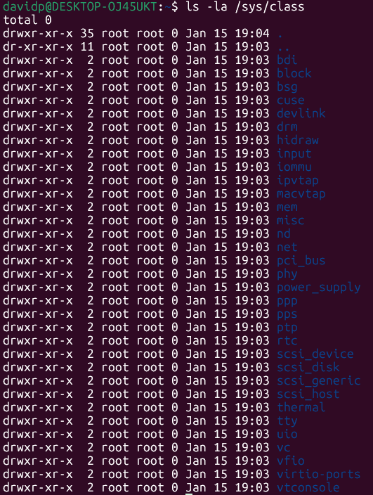
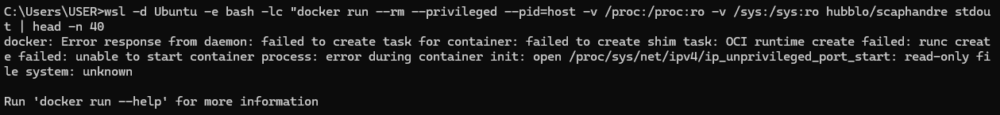
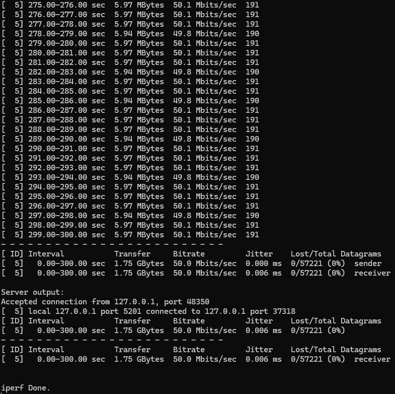
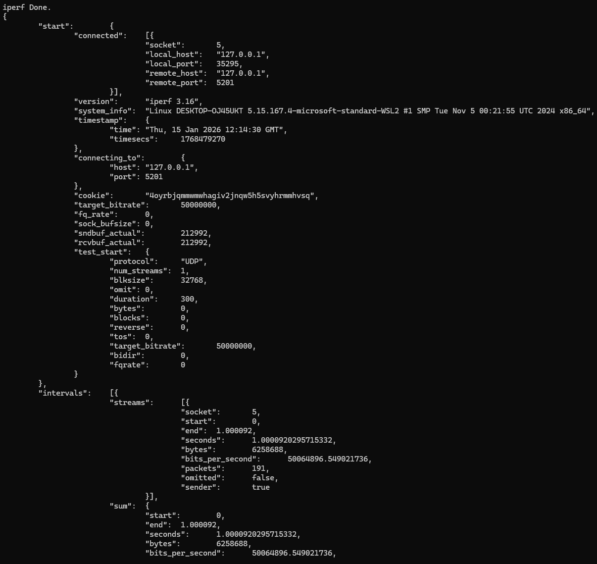
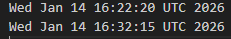
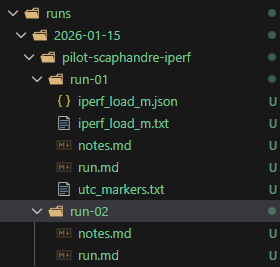

# Day 4 — Screenshot + Figure Checklist (2026-01-15)

Goal: make the Day 4 pilot note complete: environment → limitation proof → KPI proof → reproducibility.

Stored all images under:
- assets/2026-01-15/screenshots/
- assets/2026-01-15/plots/

In Day 4 notes under docs/StudyNotes/, reference images with relative paths like:

    

## Screenshot set

### 01 — WSL distro/version
Filename:

    assets/2026-01-15/screenshots/01_env_wsl_list.png

Capture:
- In PowerShell:

    wsl -l -v

What it proves:
- You’re on WSL2 + which distro.

Markdown:

    

---

### 02 — Kernel identity (WSL)
Filename:

    assets/2026-01-15/screenshots/02_env_uname.png

Capture:
- In WSL:

    uname -a

What it proves:
- Kernel string for reproducibility.

Markdown:

    

---

### 03 — iperf3 version
Filename:

    assets/2026-01-15/screenshots/03_tool_iperf3_version.png

Capture:
- In WSL:

    iperf3 --version

What it proves:
- Tool version pinned.

Markdown:

    

---

### 04 — Powercap missing (RAPL not exposed)
Filename:

    assets/2026-01-15/screenshots/04_powercap_missing.png

Capture:
- In WSL:

    ls -la /sys/class/powercap

If it errors:

    ls -la /sys/class

…and show that powercap is absent.

What it proves:
- Why Scaphandre cannot estimate power in this environment.

Markdown:

    

---

### 05 — Scaphandre failure (WSL sysctl read-only)
Filename:

    assets/2026-01-15/screenshots/05_scaphandre_sysctl_readonly.png

Capture:
- The terminal output when running Scaphandre in Docker showing the error:
  open /proc/sys/net/ipv4/ip_unprivileged_port_start: read-only file system

What it proves:
- Concrete failure mode; strengthens the limitations section.

Markdown:

    

---

### 06 — iperf3 final summary (KPI “money shot”)
Filename:

    assets/2026-01-15/screenshots/06_iperf_summary.png

Capture:
- The final client summary block from the run (the lines with:
  0.00-300.00 sec, transfer, bitrate, jitter, lost/total).

What it proves:
- Achieved 50 Mbit/s, jitter, and 0% loss.

Markdown:

    

---

### 07 — JSON-parsed KPI (optional but strong)
Filename:

    assets/2026-01-15/screenshots/07_iperf_json_parsed.png

Capture:
- PowerShell output parsing the JSON (bits_per_second, jitter_ms, lost_percent).

What it proves:
- Machine-readable confirmation of KPI.

Markdown:

    

---

### 08 — UTC markers file
Filename:

    assets/2026-01-15/screenshots/08_utc_markers.png

Capture:
- In WSL (or from VS Code):

    cat runs/2026-01-15/pilot-scaphandre-iperf/run-01/utc_markers.txt

What it proves:
- Alignment anchors for the steady-state window.

Markdown:

    

---

### 09 — Run folder contents (reproducibility)
Filename:

    assets/2026-01-15/screenshots/09_run_folder_tree.png

Capture:
- In PowerShell (repo root):

    Get-ChildItem .\runs\2026-01-15\pilot-scaphandre-iperf\run-01 -File | Sort-Object Name

Show that these exist:
- iperf_load_m.txt
- iperf_load_m.json
- utc_markers.txt
- run.md
- notes.md

What it proves:
- Everything is in-repo and reproducible.

Markdown:

    

---

## Placeholder figure (power unavailable) — how to make it

### Option A (fastest, best-looking): timeline figure
Create a simple timeline figure that shows:
- Warm-up (2 min planned)
- Load window (300s)
- Start/End UTC markers
- Callout text: Power unavailable on WSL2 (no /sys/class/powercap; Scaphandre sysctl read-only)

Tooling:
- diagrams.net (draw.io) or PowerPoint/Google Slides

Export:

    assets/2026-01-15/plots/01_placeholder_timeline.png

Markdown:

    

### Option B (more “data-y”): throughput plot from iperf3 JSON
Make a plot with time on x-axis and throughput on y-axis. For a single run, it can be a constant line at 50 Mbit/s, annotated with the UTC markers.

Export:

    assets/2026-01-15/plots/02_throughput_placeholder.png

Markdown:

    

### Option C (lowest effort): placeholder table (no image)
If you don’t want to draw a figure, include a small Markdown table in the Day 4 note:

    | Window | Start (UTC) | End (UTC) | Throughput (Mbit/s) | Jitter (ms) | Loss (%) | Power | Energy |
    |---|---|---|---:|---:|---:|---|---|
    | Load-M | Wed Jan 14 16:22:20 | Wed Jan 14 16:32:15 | 50.0 | 0.005–0.007 | 0 | N/A (WSL2) | N/A (WSL2) |

This reads extremely well in reviews and is consistent with the “software-only” boundary.
