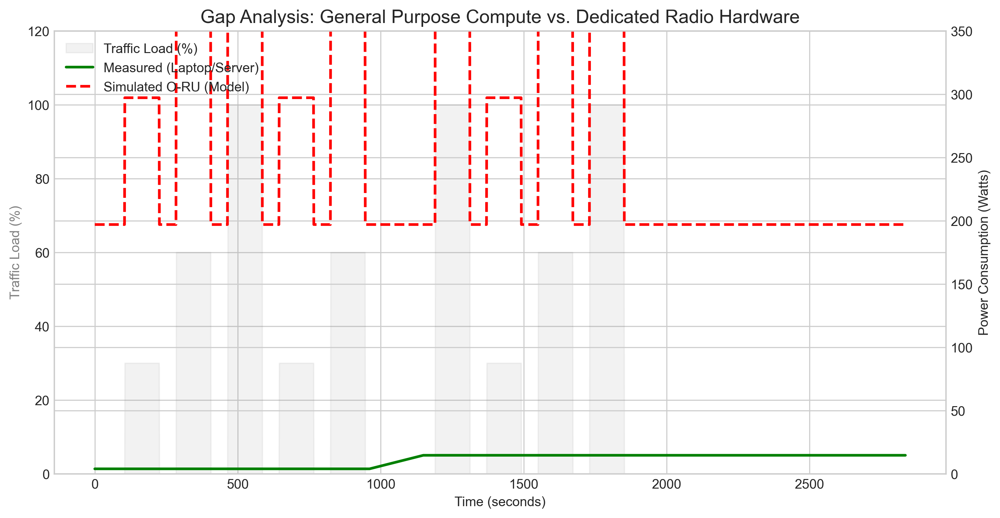

# Day 9 (Week 4): Gap Analysis Index

This Day 9 work was split into two study notes to match the Week 4 requirements (assumptions, validation plan, and reviewer-safe interpretation):

1. **Model + assumptions (how we simulate an O-RU from the measured timeline)**
   - [Virtual O-RU Power Model](2026-01-26_Day-9_Virtual-ORU-Power-Model.md)

2. **Results + interpretation (what the gap plot means and what we can/cannot claim)**
   - [Gap Analysis — Proxy vs Estimated O-RU](2026-01-26_Day-9_Gap-Analysis-Proxy-vs-ORU.md)

Main visualization:

