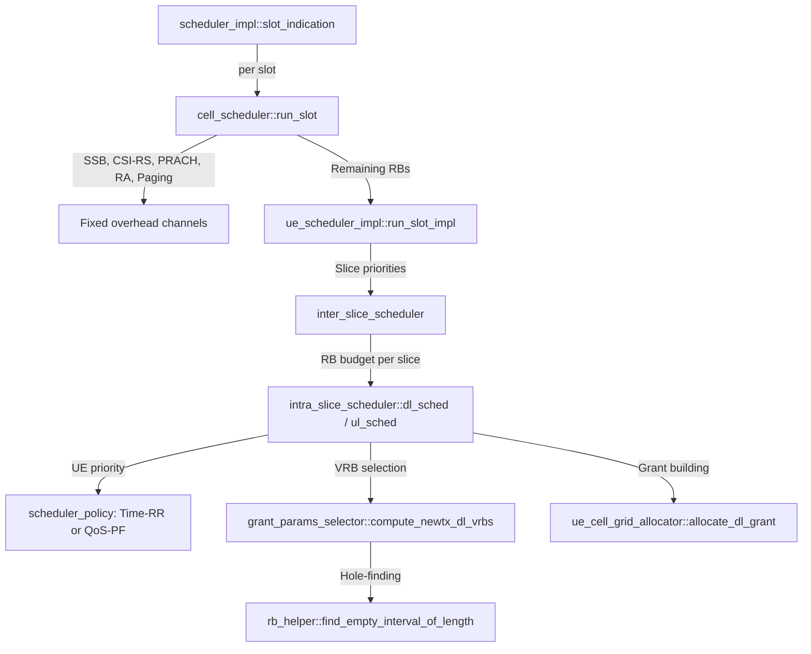

# OAI & srsRAN MAC Scheduler: PRB Scheduling in Frequency and Time Domain (2026-02-24)

Status: Complete
Deadline: 2026-02-24

This note documents the MAC scheduler modules in both OAI (OpenAirInterface) and srsRAN Project, with a specific focus on how 273 PRBs can be fully scheduled in one slot (frequency domain scheduling) versus distributing 27–28 PRBs across 10 slots (time domain scheduling). This is a prerequisite for duplicating WINLAB's RU power consumption measurements, because the scheduling strategy directly determines the O-RU Power Amplifier duty cycle and, consequently, power consumption.

## Table of Contents
- [OAI \& srsRAN MAC Scheduler: PRB Scheduling in Frequency and Time Domain (2026-02-24)](#oai--srsran-mac-scheduler-prb-scheduling-in-frequency-and-time-domain-2026-02-24)
  - [Table of Contents](#table-of-contents)
  - [Objective](#objective)
  - [1. Why MAC Scheduling Matters for RU Power](#1-why-mac-scheduling-matters-for-ru-power)
  - [2. Background: The 273-PRB Resource Grid](#2-background-the-273-prb-resource-grid)
    - [2.1 Configuration for 273 PRBs](#21-configuration-for-273-prbs)
    - [2.2 The Two Scheduling Strategies](#22-the-two-scheduling-strategies)
  - [3. OAI MAC Scheduler Architecture](#3-oai-mac-scheduler-architecture)
    - [3.1 Directory Structure and Key Files](#31-directory-structure-and-key-files)
    - [3.2 Top-Level Scheduling Loop](#32-top-level-scheduling-loop)
    - [3.3 Downlink Scheduling: Proportional Fair (PF)](#33-downlink-scheduling-proportional-fair-pf)
    - [3.4 Frequency-Domain Resource Allocation in OAI](#34-frequency-domain-resource-allocation-in-oai)
    - [3.5 Where to Intervene for Full 273-PRB Scheduling](#35-where-to-intervene-for-full-273-prb-scheduling)
  - [4. srsRAN MAC Scheduler Architecture](#4-srsran-mac-scheduler-architecture)
    - [4.1 Directory Structure and Key Files](#41-directory-structure-and-key-files)
    - [4.2 Hierarchical Scheduling Pipeline](#42-hierarchical-scheduling-pipeline)
    - [4.3 Intra-Slice Scheduler: The Core RB Allocation](#43-intra-slice-scheduler-the-core-rb-allocation)
    - [4.4 Grant Building and RB Placement](#44-grant-building-and-rb-placement)
    - [4.5 Where to Intervene for Full 273-PRB Scheduling](#45-where-to-intervene-for-full-273-prb-scheduling)
  - [5. Frequency Domain Scheduling: 273 PRBs in 1 Slot](#5-frequency-domain-scheduling-273-prbs-in-1-slot)
    - [5.1 The Concept](#51-the-concept)
    - [5.2 How OAI Achieves This](#52-how-oai-achieves-this)
    - [5.3 How srsRAN Achieves This](#53-how-srsran-achieves-this)
    - [5.4 DCI and Resource Allocation Type 1](#54-dci-and-resource-allocation-type-1)
    - [5.5 Power Implications](#55-power-implications)
  - [6. Time Domain Scheduling: 27–28 PRBs in 10 Slots](#6-time-domain-scheduling-2728-prbs-in-10-slots)
    - [6.1 The Concept](#61-the-concept)
    - [6.2 Scheduling Over Multiple Slots](#62-scheduling-over-multiple-slots)
    - [6.3 Implementation Approach](#63-implementation-approach)
    - [6.4 Power Implications](#64-power-implications)
  - [7. Side-by-Side Comparison: FDM vs TDM Scheduling](#7-side-by-side-comparison-fdm-vs-tdm-scheduling)
    - [OAI Module Mapping](#oai-module-mapping)
    - [srsRAN Module Mapping](#srsran-module-mapping)
  - [8. 3GPP Standards Basis](#8-3gpp-standards-basis)
  - [9. Connection to Our WINLAB Replication](#9-connection-to-our-winlab-replication)
  - [10. Practical Demonstration Plan](#10-practical-demonstration-plan)
    - [Experiment A: 273 PRBs in 1 Slot (Frequency Domain)](#experiment-a-273-prbs-in-1-slot-frequency-domain)
    - [Experiment B: 27 PRBs in 10 Slots (Time Domain)](#experiment-b-27-prbs-in-10-slots-time-domain)
    - [Verification Metrics](#verification-metrics)
  - [Key Takeaways](#key-takeaways)
  - [References](#references)

---

## Objective

After reading this note, the reader should be able to:
1. **Identify** the exact modules and source files in OAI and srsRAN responsible for MAC scheduling.
2. **Explain** how frequency-domain scheduling fills all 273 PRBs in a single slot.
3. **Explain** how time-domain scheduling distributes 27–28 PRBs across 10 slots to deliver the same total resource volume.
4. **Quantify** the power consumption difference between these two approaches.
5. **Show** how this maps to the WINLAB/POET measurement methodology.

---

## 1. Why MAC Scheduling Matters for RU Power

The MAC scheduler is the **decision-maker** that determines which UEs get resources, how many PRBs they receive, and in which slot(s). This decision directly controls:

- **PA Duty Cycle:** The O-RU Power Amplifier must be active for every OFDM symbol that contains at least one occupied subcarrier. If the scheduler spreads data across all slots (FDM), the PA never sleeps. If it concentrates data into fewer slots (TDM), the PA can enter micro-sleep during empty slots.
- **PRB Utilization:** The WINLAB/POET paper reports DL PRB utilization as a key metric alongside power. Understanding how the scheduler fills PRBs is essential to reproduce their load scenarios.
- **Load Definition:** WINLAB defines load as "DU PRB load of 70%" (1 UE) and "100%" (2 UEs). To duplicate this, we must understand how the scheduler maps UE traffic demand to PRB occupancy.

$$P_{total} = P_{static} + \Delta_p \cdot P_{max} \cdot \underbrace{\frac{N_{PRB,used}}{N_{PRB,total}}}_{= \text{load fraction } x}$$

The load fraction $x$ is **directly controlled by the scheduler**.

---

## 2. Background: The 273-PRB Resource Grid

### 2.1 Configuration for 273 PRBs

The maximum number of PRBs in FR1 is achieved with:

| Parameter | Value |
|---|---|
| Channel Bandwidth | 100 MHz |
| Subcarrier Spacing (µ) | 30 kHz (µ=1) |
| Number of PRBs | **273** |
| Slot Duration | 0.5 ms |
| Symbols per Slot | 14 (normal CP) |
| Total REs per Slot | 273 × 12 × 14 = **45,864** |

This is defined in 3GPP TS 38.101-1 Table 5.3.2-1.

### 2.2 The Two Scheduling Strategies

The professor's question asks us to demonstrate two equivalent resource allocations:

**Strategy A — Frequency Domain (FDM):** Allocate **all 273 PRBs in 1 slot**.
- Total resource volume: 273 PRBs × 1 slot = **273 PRB-slots**
- PA: ON for all 14 symbols in that slot
- Suitable for a single UE with a large buffer

**Strategy B — Time Domain (TDM):** Allocate **~27 PRBs in each of 10 consecutive slots**.
- Total resource volume: 27 PRBs × 10 slots = **270 PRB-slots** (≈ 273)
- PA: ON for all 14 symbols in all 10 slots (but at lower bandwidth per symbol)
- Alternative: 28 PRBs × 9 slots + 21 PRBs × 1 slot = 273 PRB-slots

```
Strategy A: Frequency Domain (273 PRBs × 1 slot)
Frequency ▲
 PRB 272  │ ████████████████████████████████████████████████████████████
 PRB 200  │ ████████████████████████████████████████████████████████████
 PRB 100  │ ████████████████████████████████████████████████████████████
 PRB   0  │ ████████████████████████████████████████████████████████████
          └───────── Slot N ──────────  Slot N+1 (empty)  Slot N+2 ...
            ALL 273 RBs used              0 RBs             0 RBs

Strategy B: Time Domain (27 PRBs × 10 slots)
Frequency ▲
 PRB 272  │ ..............  ..............  ..............  ..............
 PRB  27  │ ██████████████  ██████████████  ██████████████  ██████████████
 PRB   0  │ ██████████████  ██████████████  ██████████████  ██████████████
          └───── Slot N ──── Slot N+1 ──── Slot N+2 ──── Slot N+3 ... ×10
            27 RBs used      27 RBs used    27 RBs used    27 RBs used
```

Both strategies deliver the **same total data volume** (assuming same MCS), but they have fundamentally different power profiles on the O-RU.

---

## 3. OAI MAC Scheduler Architecture

### 3.1 Directory Structure and Key Files

OAI's NR MAC scheduler for the gNB resides in:
```
openairinterface5g/openair2/LAYER2/NR_MAC_gNB/
├── gNB_scheduler.c            ← Top-level slot scheduler (calls DL + UL)
├── gNB_scheduler_dlsch.c      ← DL scheduling: PF algorithm, PRB allocation
├── gNB_scheduler_ulsch.c      ← UL scheduling: PUSCH allocation 
├── gNB_scheduler_RA.c         ← Random Access scheduling
├── gNB_scheduler_bch.c        ← Broadcast channel scheduling (MIB)
├── gNB_scheduler_primitives.c ← Utility functions (CCE, PUCCH, timing)
├── gNB_scheduler_phytest.c    ← PHY test mode scheduler
├── gNB_scheduler_uci.c        ← UCI/HARQ feedback handling
├── gNB_scheduler_srs.c        ← SRS scheduling
├── nr_mac_gNB.h               ← Main MAC header with data structures
├── mac_proto.h                ← Function prototypes
├── config.c                   ← Cell/Radio configuration
└── main.c                     ← Initialization
```

**Source:** [OAI GitLab - NR_MAC_gNB](https://gitlab.eurecom.fr/oai/openairinterface5g/-/tree/develop/openair2/LAYER2/NR_MAC_gNB)

### 3.2 Top-Level Scheduling Loop

The main entry point is `gNB_dlsch_ulsch_scheduler()` in `gNB_scheduler.c`. It is called once per slot (every 0.5 ms at µ=1):

```c
void gNB_dlsch_ulsch_scheduler(module_id_t module_idP, 
                                frame_t frame, slot_t slot, 
                                NR_Sched_Rsp_t *sched_info)
{
    // 1. Clear VRB maps (reset resource grid for this slot)
    for (int i = 0; i < num_beams; i++)
        memset(cc[CC_id].vrb_map[i], 0, sizeof(uint16_t) * MAX_BWP_SIZE);

    // 2. Schedule "always-on" channels (non-negotiable power baseline)
    schedule_nr_mib(module_idP, frame, slot, &sched_info->DL_req);
    schedule_nr_sib1(...);
    schedule_nr_prach(...);
    nr_csirs_scheduling(...);       // CSI-RS
    nr_csi_meas_reporting(...);     // CSI measurement
    nr_schedule_srs(...);           // SRS
    nr_schedule_RA(...);            // Random Access

    // 3. Schedule UL (PUSCH)
    nr_schedule_ulsch(module_idP, frame, slot, &sched_info->UL_dci_req);

    // 4. Schedule DL (PDSCH) — this is where PRB allocation happens
    nr_schedule_ue_spec(module_idP, frame, slot, 
                        &sched_info->DL_req, &sched_info->TX_req);
}
```

**Key insight:** Steps 1–2 define the overhead (SSB, SIB1, PRACH, CSI-RS). Steps 3–4 are where the scheduler decides PRB allocation for user data. The overhead reduces the 273 available PRBs; the remaining PRBs are available for PDSCH/PUSCH.

### 3.3 Downlink Scheduling: Proportional Fair (PF)

OAI uses a **Proportional Fair (PF)** scheduling algorithm by default. The core function is `pf_dl()` in `gNB_scheduler_dlsch.c`.

**Algorithm overview:**
1. **Retransmissions first:** Loop through UE list, handle HARQ retransmissions before new data.
2. **Compute PF coefficient** for each UE with pending data:
   ```c
   float coeff_ue = (float) tbs / UE->dl_thr_ue;
   ```
   Where `tbs` is the hypothetical TBS for 1 RB and `dl_thr_ue` is the exponential moving average throughput.
3. **Sort UEs** by PF coefficient (highest first) — greedy, highest relative gain first.
4. **Allocate RBs:** For each UE (in priority order):
   - Find the first contiguous block of free RBs in the VRB map
   - Compute the number of RBs needed to satisfy the UE's buffer (`nr_find_nb_rb()`)
   - Allocate up to `max_rbSize` (limited by available contiguous free RBs)
   - Mark allocated RBs in the VRB map

**Critical code path for PRB allocation:**
```c
// In pf_dl() — frequency domain allocation
int rbStart = 0;  // WRT BWP start
int rbStop = bwp_info.bwpSize - 1;

// Find first free RB
while (rbStart < rbStop && (rballoc_mask[rbStart + bwp_start] & slbitmap))
    rbStart++;

// Find contiguous free RBs from rbStart
uint16_t max_rbSize = 1;
while (rbStart + max_rbSize <= rbStop 
       && !(rballoc_mask[rbStart + max_rbSize + bwp_start] & slbitmap))
    max_rbSize++;

// Compute actual RBs needed based on buffer size
nr_find_nb_rb(Qm, R, 1, nrOfLayers, nrOfSymbols, 
              N_PRB_DMRS * N_DMRS_SLOT,
              num_total_bytes + overhead,
              min_rbSize, max_rbSize,
              &tb_size, &rbSize);
```

### 3.4 Frequency-Domain Resource Allocation in OAI

OAI uses **Resource Allocation Type 1** (contiguous VRBs) for PDSCH, as enforced by:

```c
AssertFatal(pdsch_Config == NULL
            || pdsch_Config->resourceAllocation 
               == NR_PDSCH_Config__resourceAllocation_resourceAllocationType1,
            "Only frequency resource allocation type 1 is currently supported\n");
```

This means:
- The DCI `frequency_domain_assignment` field encodes `(rbStart, rbSize)` as a **Resource Indication Value (RIV)** per 3GPP TS 38.214 §5.1.2.2.2.
- The maximum schedulable grant in one DCI is the **entire BWP** (up to 273 PRBs at 100 MHz).
- The VRB-to-PRB mapping is **non-interleaved** (`VRBtoPRBMapping = 0`).

### 3.5 Where to Intervene for Full 273-PRB Scheduling

To schedule **all 273 PRBs to a single UE in one slot** (Strategy A):

1. **Single UE with sufficient buffer:** If only 1 UE has data, OAI will naturally allocate all available PRBs to it (PF degenerates to max throughput with 1 user).
2. **phy_test mode:** OAI's `gNB_scheduler_phytest.c` generates full-bandwidth grants for testing, filling the entire BWP.
3. **Configuration knobs:**
   - `max_num_ue` limits how many UEs can be scheduled per slot
   - `carrierBandwidth` in `scs_SpecificCarrierList` defines the total PRBs
   - Set channel bandwidth to 100 MHz and SCS to 30 kHz → 273 PRBs

---

## 4. srsRAN MAC Scheduler Architecture

### 4.1 Directory Structure and Key Files

srsRAN uses a hierarchical C++ design:

```
srsran_project/lib/scheduler/
├── scheduler_impl.cpp              ← Entry point: slot_indication()
├── cell_scheduler.cpp              ← Per-cell slot loop (SSB, CSI, RA, then UE sched)
├── ue_scheduling/
│   ├── ue_scheduler_impl.cpp       ← Per-cell-group UE pipeline
│   ├── intra_slice_scheduler.cpp   ← Core DL/UL PRB allocation logic ★
│   ├── intra_slice_scheduler.h
│   ├── ue_cell_grid_allocator.cpp  ← Grant builders (PDCCH → PDSCH/PUSCH)
│   ├── grant_params_selector.cpp   ← VRB selection, MCS, TBS computation
│   └── ue_fallback_scheduler.cpp   ← SRB0/1 fallback paths
├── slicing/
│   ├── inter_slice_scheduler.cpp   ← Slice-level RB budget arbitration
│   └── inter_slice_scheduler.h
├── policy/
│   ├── scheduler_policy.h          ← Abstract scheduling policy interface
│   ├── scheduler_time_rr.cpp       ← Time-domain Round Robin policy
│   └── scheduler_time_qos.cpp      ← QoS/Proportional Fair policy
├── cell/
│   ├── resource_grid.cpp           ← Per-slot DL/UL resource grid tracking
│   ├── scheduler_prb.cpp           ← PRB/RBG bitmap helpers
│   └── vrb_alloc.cpp               ← VRB allocation type 0/1 helpers
└── support/
    └── rb_helper.h                 ← find_empty_interval_of_length() ★
```

**Source:** [srsRAN GitHub](https://github.com/srsran/srsran_project), code snapshot in `assets/srsRAN Schedulers/scheduler_snapshot/`

### 4.2 Hierarchical Scheduling Pipeline



Each level has a clear responsibility:
- **`scheduler_impl`**: Receives the PHY "tick" and dispatches to cell schedulers.
- **`cell_scheduler`**: Manages fixed-overhead channels, then delegates to UE scheduler.
- **`inter_slice_scheduler`**: Divides RBs among network slices (e.g., eMBB vs URLLC).
- **`intra_slice_scheduler`**: The **core decision point** — determines how many UEs to schedule per slot and how many RBs each gets.
- **`scheduler_policy`**: Determines UE ordering (who goes first), NOT grant size.
- **`rb_helper`**: The low-level contiguous-hole finder (first-fit algorithm).

### 4.3 Intra-Slice Scheduler: The Core RB Allocation

This is where FDM vs TDM is determined. The key function is `schedule_dl_newtx_candidates()` in `intra_slice_scheduler.cpp`:

**Two-stage flow:**
1. **Stage 1 — Reserve PDCCH/PUCCH:** For each UE (sorted by policy priority), reserve DCI resources. Accumulate target `rbs_to_alloc`.
2. **Stage 2 — Assign VRBs:** Call `compute_newtx_dl_vrbs()` to find a contiguous interval in the VRB map, then build the grant.

**The "Equal Share" heuristic** (from the code analysis in our previous deep-dive):
```cpp
// Simplified representation of the allocation logic
unsigned ues_to_alloc = std::min(candidates.size() / 4, 8);  // Heuristic
unsigned max_nof_rbs = slice.remaining_rbs();
unsigned rbs_per_ue = std::max(max_nof_rbs / ues_to_alloc, MIN_RB_PER_GRANT);
```

**This is why srsRAN defaults to FDM:** It divides available RBs equally among active UEs, ensuring all UEs transmit in every slot. The PA is ON for the full slot duration because every symbol has at least some occupied subcarriers.

**Slot-level caps** that encourage time-spreading:
- `expected_pdschs_per_slot`: Target number of PDSCH grants per slot
- `max_pdschs_to_alloc`: Hard cap on grants per slot
- `max_pdcch_alloc_attempts_per_slot`: PDCCH resource limit

### 4.4 Grant Building and RB Placement

The VRB selection uses **first-fit contiguous hole finding**:

```cpp
// rb_helper.h
crb_interval find_empty_interval_of_length(const prb_bitmap& used_crbs, 
                                            unsigned nof_rbs, 
                                            unsigned start_crb);
// Scans from start_crb upward, finds the first contiguous block of nof_rbs 
// free CRBs. Returns the longest available if nof_rbs is not fully available.
```

This function is used for:
- DL new transmissions (`compute_newtx_dl_vrbs`)
- DL retransmissions (`compute_retx_dl_vrbs`)
- UL new/retx transmissions
- Fallback/RA/Paging paths

### 4.5 Where to Intervene for Full 273-PRB Scheduling

To force **all 273 PRBs to a single UE** in srsRAN:

1. **Set `max_ue_grants = 1`** in `intra_slice_scheduler`: Force only 1 UE per slot → that UE gets all available RBs.
2. **Use test mode:** srsRAN supports a test mode that generates full-bandwidth grants.
3. **Configuration:** In the gNB config file:
   ```yaml
   cell_cfg:
     dl_arfcn: 632628          # Band n78
     band: 78
     channel_bandwidth_MHz: 100  # → 273 PRBs at 30 kHz SCS
     common_scs: 30              # µ=1
   ```

---

## 5. Frequency Domain Scheduling: 273 PRBs in 1 Slot

### 5.1 The Concept

**Goal:** A single UE receives a DCI that grants all 273 PRBs in one slot.

```
Frequency ▲
 PRB 272  │ ██ ██ ██ ██ ██ ██ ██ ██ ██ ██ ██ ██ ██ ██  ← All belong to UE #1
          │ .. .. .. .. .. .. .. .. .. .. .. .. .. ..
 PRB 136  │ ██ ██ ██ ██ ██ ██ ██ ██ ██ ██ ██ ██ ██ ██
          │ .. .. .. .. .. .. .. .. .. .. .. .. .. ..
 PRB   0  │ ██ ██ ██ ██ ██ ██ ██ ██ ██ ██ ██ ██ ██ ██
          └──Sym0──Sym1──...────────────────── Sym13──►  Time
          ◄─────────────── 1 Slot (0.5 ms) ──────────►
```

### 5.2 How OAI Achieves This

In OAI, when a single UE has a sufficiently large RLC buffer:

1. `update_dlsch_buffer()` reports `num_total_bytes > 0`.
2. `pf_dl()` finds this UE has the highest PF coefficient (trivially, since it's the only one).
3. `nr_find_nb_rb()` computes the number of RBs needed:
   ```c
   // bw = carrierBandwidth = 273 (for 100 MHz, 30 kHz SCS)
   n_rb_sched[beam.idx] = bw;  // Initially all 273 RBs available
   
   // After overhead (PDCCH CORESET, CSI-RS), max_rbSize ≈ 260–270
   nr_find_nb_rb(Qm, R, 1, nrOfLayers, nrOfSymbols,
                 N_PRB_DMRS * N_DMRS_SLOT,
                 num_total_bytes + overhead,
                 min_rbSize,     // 5
                 max_rbSize,     // up to ~270 (limited by overhead)
                 &tb_size, &rbSize);
   ```
4. The resulting PDSCH PDU has `rbStart = 0, rbSize = 273` (minus overhead RBs).

**DCI fields:**
```
pdsch_pdu->BWPSize  = 273;
pdsch_pdu->BWPStart = 0;
pdsch_pdu->resourceAlloc = 1;  // Type 1
pdsch_pdu->rbStart = 0;        // Start of BWP
pdsch_pdu->rbSize = 273;       // Full bandwidth
```

### 5.3 How srsRAN Achieves This

In srsRAN, with a single UE:

1. `inter_slice_scheduler` gives all 273 RBs to the default slice.
2. `intra_slice_scheduler` sees 1 candidate UE → allocates 100% of available RBs.
3. `rb_helper::find_empty_interval_of_length(used_crbs, 273, 0)` returns CRBs [0, 273).
4. `grant_params_selector::compute_newtx_dl_vrbs()` returns the full interval.

### 5.4 DCI and Resource Allocation Type 1

Both OAI and srsRAN use **Resource Allocation Type 1** (3GPP TS 38.214 §5.1.2.2.2), which encodes the grant as a Resource Indication Value (RIV):

$$RIV = \begin{cases} N_{BWP}^{size}(L_{RBs} - 1) + RB_{start} & \text{if } (L_{RBs} - 1) \leq \lfloor N_{BWP}^{size}/2 \rfloor \\ N_{BWP}^{size}(N_{BWP}^{size} - L_{RBs} + 1) + (N_{BWP}^{size} - 1 - RB_{start}) & \text{otherwise} \end{cases}$$

For 273 PRBs in 1 slot:
- $N_{BWP}^{size} = 273$, $RB_{start} = 0$, $L_{RBs} = 273$
- Since $(273 - 1) = 272 > \lfloor 273/2 \rfloor = 136$, use the second formula:
- $RIV = 273 \times (273 - 273 + 1) + (273 - 1 - 0) = 273 \times 1 + 272 = 545$

The DCI `frequency_domain_assignment` field carries this RIV, requiring $\lceil \log_2(273 \times 274 / 2) \rceil = 16$ bits.

### 5.5 Power Implications

When all 273 PRBs are used in a single slot:
- **All 14 OFDM symbols** have active subcarriers → PA is ON for the entire 0.5 ms slot
- **PA output power** is at maximum (all subcarriers active → maximum power spectral density)
- **Single-slot burst:** If data is only sufficient for 1 slot, the remaining slots can be empty → PA can sleep

This is actually **power-efficient at the PA level** because:
1. The PA operates at its most efficient point (near saturation)
2. Subsequent empty slots allow micro-sleep (SM1 or SM2)
3. The total energy = $P_{max} \times T_{slot}$ for 1 slot, vs. $P_{partial} \times 10 \times T_{slot}$ for 10 slots

---

## 6. Time Domain Scheduling: 27–28 PRBs in 10 Slots

### 6.1 The Concept

**Goal:** The same data volume is delivered using ~27 PRBs per slot across 10 consecutive slots.

```
Frequency ▲
 PRB 272  │ ......  ......  ......  ......  ......  ......  ......  ......  ......  ......
          │        
 PRB  27  │ ██████  ██████  ██████  ██████  ██████  ██████  ██████  ██████  ██████  ██████
 PRB   0  │ ██████  ██████  ██████  ██████  ██████  ██████  ██████  ██████  ██████  ██████
          └─Slot 0─ Slot 1─ Slot 2─ Slot 3─ Slot 4─ Slot 5─ Slot 6─ Slot 7─ Slot 8─ Slot 9─►
            27 RBs  27 RBs  27 RBs  27 RBs  27 RBs  27 RBs  27 RBs  27 RBs  27 RBs  27 RBs
```

### 6.2 Scheduling Over Multiple Slots

When the scheduler limits each grant to 27 PRBs:
- Each slot's DCI has `rbSize = 27`, `rbStart = 0`
- The UE receives 10 consecutive grants (one per slot)
- Total PRBs = 27 × 10 = 270 ≈ 273
- The throughput is approximately the same (slightly less due to DMRS overhead per grant)

**TBS calculation comparison** (assuming 256QAM, R=0.93, 2 layers, 12 OFDM data symbols):

| Strategy | PRBs | Symbols | DMRS REs/PRB | Data REs | TBS (bytes) |
|---|---|---|---|---|---|
| A: 273×1 slot | 273 | 12 | 12 | 273×12×12 - DMRS ≈ 38,220 | ~71,000 |
| B: 27×1 slot | 27 | 12 | 12 | 27×12×12 - DMRS ≈ 3,780 | ~7,000 |
| B: 27×10 slots | 27×10 | 12×10 | 12×10 | ~37,800 | ~70,000 |

The total data delivered is approximately equal, confirming the professor's equivalence.

### 6.3 Implementation Approach

**In OAI:** The `nr_find_nb_rb()` function's `max_rbSize` parameter controls the maximum grant size. To limit to 27 PRBs:
```c
// Modify in pf_dl():
max_rbSize = min(max_rbSize, 27);  // Cap at 27 PRBs per grant
```

This forces the scheduler to only allocate 27 PRBs per slot. The UE's remaining buffer data will be scheduled in subsequent slots (10 slots to deliver 273 PRBs worth of data).

**In srsRAN:** The `intra_slice_scheduler` can be modified:
```cpp
// Modify in schedule_dl_newtx_candidates():
// Cap the VRB interval to 27 PRBs
unsigned max_rbs = std::min(slice.remaining_rbs(), 27u);
```

Alternatively, use the **slice configuration** to limit `max_rbs_per_grant`:
```yaml
cell_cfg:
  slicing:
    - sst: 1
      max_prb: 27    # Limit to 27 PRBs per slice per slot
```

### 6.4 Power Implications

When only 27 PRBs are used per slot across 10 slots:
- **All 10 slots have active symbols** → PA is ON for 10 × 0.5 ms = 5 ms
- **PA operates at ~10% bandwidth** (27/273 ≈ 10% of total subcarriers)
- **NO sleep opportunity** during the 10-slot window
- PA power per symbol is lower (fewer active subcarriers), but the PA static/bias power remains

Using the EARTH model:
$$P_{TDM-spread} = P_0 + \Delta_p \cdot P_{max} \cdot \frac{27}{273} \approx P_0 + 0.1 \cdot \Delta_p \cdot P_{max}$$

This is applied for **all 10 slots**, so total energy over 10 slots:
$$E_{TDM-spread} = 10 \cdot T_{slot} \cdot (P_0 + 0.1 \cdot \Delta_p \cdot P_{max})$$

Versus Strategy A (1 slot at full load + 9 empty slots with sleep):
$$E_{FDM-burst} = 1 \cdot T_{slot} \cdot (P_0 + \Delta_p \cdot P_{max}) + 9 \cdot T_{slot} \cdot P_{sleep}$$

Since $P_{sleep} \ll P_0$, Strategy A (273 PRBs in 1 slot) is **more energy-efficient** when the O-RU supports sleep modes.

---

## 7. Side-by-Side Comparison: FDM vs TDM Scheduling

| Aspect | Freq Domain: 273 PRBs × 1 Slot | Time Domain: 27 PRBs × 10 Slots |
|---|---|---|
| **Total PRB-slots** | 273 | 270 (≈273) |
| **Slots occupied** | 1 | 10 |
| **PRB utilization per slot** | 100% | ~10% |
| **PA ON time** | 0.5 ms | 5.0 ms |
| **PA duty cycle (over 10 slots)** | 10% | 100% |
| **Sleep opportunity** | 9 empty slots (4.5 ms) | None |
| **Throughput** | ~Same total | ~Same total |
| **Latency** | Low (all data in 1 slot) | Higher (spread over 5 ms) |
| **Energy (with sleep modes)** | **Lower** | Higher |
| **Energy (without sleep modes)** | Similar | Similar |
| **DMRS overhead** | 1 set | 10 sets (higher overhead) |
| **PDCCH overhead** | 1 DCI | 10 DCIs |

### OAI Module Mapping

| Component | File | Role |
|---|---|---|
| Slot entry | `gNB_scheduler.c` | `gNB_dlsch_ulsch_scheduler()` — per-slot dispatch |
| DL scheduling | `gNB_scheduler_dlsch.c` | `nr_schedule_ue_spec()` → `pf_dl()` |
| PRB calculation | `gNB_scheduler_dlsch.c` | `nr_find_nb_rb()` — computes rbSize from buffer/MCS |
| VRB map | `gNB_scheduler_dlsch.c` | `rballoc_mask[]` — tracks occupied VRBs per slot |
| UL scheduling | `gNB_scheduler_ulsch.c` | Symmetric to DL |
| Config | `config.c` | `carrierBandwidth` → 273 for 100 MHz/30 kHz |

### srsRAN Module Mapping

| Component | File | Role |
|---|---|---|
| Slot entry | `scheduler_impl.cpp` | `slot_indication()` — per-slot dispatch |
| Cell loop | `cell_scheduler.cpp` | `run_slot()` — overhead + UE scheduler |
| Slice arbitration | `inter_slice_scheduler.cpp` | RB budget per slice |
| PRB allocation | `intra_slice_scheduler.cpp` | `schedule_dl_newtx_candidates()` — core FDM/TDM knob ★ |
| VRB selection | `grant_params_selector.cpp` | `compute_newtx_dl_vrbs()` |
| Hole finder | `rb_helper.h` | `find_empty_interval_of_length()` — first-fit |
| Grid tracking | `resource_grid.cpp` | Per-slot CRB occupancy bitmap |
| Policy | `scheduler_time_rr.cpp` / `scheduler_time_qos.cpp` | UE ordering only |

---

## 8. 3GPP Standards Basis

The scheduling mechanisms are defined in:

| Specification | Section | Content |
|---|---|---|
| **TS 38.214** | §5.1.2.2 | Resource allocation in frequency domain (Type 0/1) |
| **TS 38.214** | §5.1.2.1 | Resource allocation in time domain (k0, SLIV) |
| **TS 38.214** | §5.1.3 | Modulation order, target code rate, TBS determination |
| **TS 38.213** | §11.1.1 | Slot format indication (D/U/F symbols) |
| **TS 38.213** | §10 | PDCCH procedures (DCI formats, search spaces) |
| **TS 38.321** | §5.4 | MAC scheduler framework (BSR, SR, DRX) |
| **TS 38.331** | - | RRC parameters (BWP config, PDSCH-Config, TDA lists) |
| **TS 38.101-1** | Table 5.3.2-1 | Maximum RBs per channel bandwidth per SCS |

**Resource Allocation Type 1** (used by both OAI and srsRAN):
- Encodes a contiguous set of VRBs as RIV = f(rbStart, rbSize)
- Maximum grant = entire BWP (273 PRBs at 100 MHz / 30 kHz)
- Signalled in DCI Format 1_0 (fallback) or 1_1 (UE-specific)

**Time Domain Allocation:**
- PDSCH-TimeDomainResourceAllocation IE: {k0, mappingType, startSymbolAndLength (SLIV)}
- k0 = number of slots between DCI and PDSCH (typically 0 for same-slot scheduling)
- SLIV encodes (startSymbol, nrOfSymbols) — how many symbols within the slot

---

## 9. Connection to Our WINLAB Replication

| WINLAB/POET Observation | Our Understanding (from this note) |
|---|---|
| "1 UE → DU PRB load of 70%" | OAI PF scheduler allocates PRBs proportional to buffer; 70% ≈ 191 PRBs (at 273 total) |
| "2 UEs → DU PRB load of 100%" | Both UEs together fill all 273 PRBs (FDM: ~136 each) |
| "DL throughput 65 Mb/s (1 UE)" | At 70% PRB utilization, MCS determines throughput; consistent with mid-range MCS |
| "DL throughput 84 Mb/s (2 UEs)" | Full bandwidth utilization increases aggregate throughput |
| Power scales with load | Linear model: $P = P_0 + \Delta_p P_{max} x$; scheduler controls load fraction $x$ |

**To fully duplicate WINLAB:**
1. Configure gNB with 100 MHz BW, 30 kHz SCS → 273 PRBs
2. Use OAI rfsim or srsRAN ZMQ to generate controlled load
3. Attach 1 UE with iPerf to target ~70% PRB utilization
4. Attach 2 UEs to target ~100% PRB utilization  
5. Measure power at each load point using Scaphandre/RAPL (platform proxy) or smart PDU (real hardware)

---

## 10. Practical Demonstration Plan

### Experiment A: 273 PRBs in 1 Slot (Frequency Domain)

1. **Setup:** srsRAN gNB (ZMQ mode) + srsUE, 100 MHz BW, 30 kHz SCS
2. **Traffic:** Single UE, iPerf UDP DL at maximum rate
3. **Observation:** MAC PCAP or scheduler JSON metrics showing:
   - `pdsch_prbs_used_per_tdd_slot_idx` = 273 for DL slots
   - Console output: `rbSize = 273` (or close, minus overhead)
4. **Evidence:** Screenshot of Wireshark MAC PCAP showing DCI with RIV corresponding to 273 PRBs

### Experiment B: 27 PRBs in 10 Slots (Time Domain)

1. **Setup:** Same as above, but modify scheduler config:
   - srsRAN: Set slice `max_prb: 27` or modify `intra_slice_scheduler.cpp`
   - OAI: Cap `max_rbSize = 27` in `pf_dl()`
2. **Traffic:** Same iPerf rate as Experiment A
3. **Observation:** MAC PCAP showing:
   - `rbSize = 27` per slot, across 10 consecutive slots
   - Same aggregate throughput over the 10-slot window
4. **Evidence:** Side-by-side resource grid visualization

### Verification Metrics

| Metric | Exp A (273×1) | Exp B (27×10) |
|---|---|---|
| PRBs per DCI | 273 | 27 |
| DCIs sent | 1 | 10 |
| Total PRBs | 273 | 270 |
| Aggregate throughput | ~X Mbps | ~X Mbps (same) |
| DL latency | Low | Higher |
| Power (Scaphandre) | Short spike | Sustained lower level |

---

## Key Takeaways

1. **The MAC scheduler is the control point** for PRB allocation in both frequency and time domains. OAI uses `pf_dl()` in `gNB_scheduler_dlsch.c`; srsRAN uses `intra_slice_scheduler::schedule_dl_newtx_candidates()`.

2. **273 PRBs = 100 MHz at 30 kHz SCS.** This is the maximum for FR1 and is the configuration used in most WINLAB/POET experiments.

3. **Frequency domain scheduling (273 PRBs × 1 slot)** is achieved by giving a single UE the entire BWP bandwidth in one DCI. Both OAI and srsRAN do this naturally when only one UE has data.

4. **Time domain scheduling (27 PRBs × 10 slots)** requires limiting the per-slot grant size. This can be done via code modification (cap `max_rbSize`) or configuration (slice `max_prb` limit).

5. **Both strategies deliver the same data volume** (~273 PRB-slots), but with fundamentally different power profiles. The frequency-domain approach enables PA sleep in the 9 unused slots; the time-domain approach keeps the PA active for all 10 slots.

6. **The scheduling policy (RR / PF / QoS) determines UE priority order** but does NOT directly control grant size or bandwidth occupancy. To change FDM↔TDM behavior, modify the grant size calculation in the intra-slice scheduler.

7. **For WINLAB duplication:** Configure 100 MHz / 30 kHz → 273 PRBs, generate controlled load via iPerf + UE emulator, and observe PRB utilization alongside power metrics.

---

## References

1. 3GPP TS 38.214 v17.6.0, "NR; Physical layer procedures for data" — §5.1.2 (Resource allocation in frequency and time domain), §5.1.3 (TBS determination).
2. 3GPP TS 38.213 v17.2.0, "NR; Physical layer procedures for control" — §10 (PDCCH), §11 (Slot format indication).
3. 3GPP TS 38.321 v17.x, "NR; MAC protocol specification" — §5.4 (Scheduling), §5.22 (Buffer Status Reporting).
4. 3GPP TS 38.101-1, "NR; UE radio transmission and reception; Part 1: Range 1" — Table 5.3.2-1 (Max RBs per BW/SCS).
5. OAI Source Code, `openair2/LAYER2/NR_MAC_gNB/gNB_scheduler_dlsch.c` ([GitLab](https://gitlab.eurecom.fr/oai/openairinterface5g/-/blob/develop/openair2/LAYER2/NR_MAC_gNB/gNB_scheduler_dlsch.c)).
6. OAI Source Code, `openair2/LAYER2/NR_MAC_gNB/gNB_scheduler.c` ([GitLab](https://gitlab.eurecom.fr/oai/openairinterface5g/-/blob/develop/openair2/LAYER2/NR_MAC_gNB/gNB_scheduler.c)).
7. srsRAN Project Source Code, `lib/scheduler/ue_scheduling/intra_slice_scheduler.cpp` ([GitHub](https://github.com/srsran/srsran_project)).
8. srsRAN Project Documentation, "O-RAN gNB Components" ([docs.srsran.com](https://docs.srsran.com/projects/project/en/latest/knowledge_base/source/gnb_components/source/index.html)).
9. ShareTechNote, "5G/NR — Resource Allocation" ([sharetechnote.com](https://www.sharetechnote.com/html/5G/5G_ResourceAllocation.html)).
10. Our project: `docs/StudyNotes/2026-02-03_srsRAN-Scheduler-Deep-Dive.md` (FDM code path analysis).
11. Our project: `docs/StudyNotes/2026-02-12_5G-NR-Resource-Grid-and-Scheduling-Fundamentals.md` (Resource grid foundation).
12. Our project: `assets/srsRAN Schedulers/scheduler_snapshot/scheduler_power_study.md` (srsRAN code map).
13. N. K. Shankaranarayanan et al., "POET: A Platform for O-RAN Energy Efficiency Testing," WINLAB, Rutgers University, 2024.
14. G. Auer et al., "How much energy is needed to run a wireless network?," IEEE Wireless Communications, vol. 18, no. 5, pp. 40–49, Oct. 2011.
