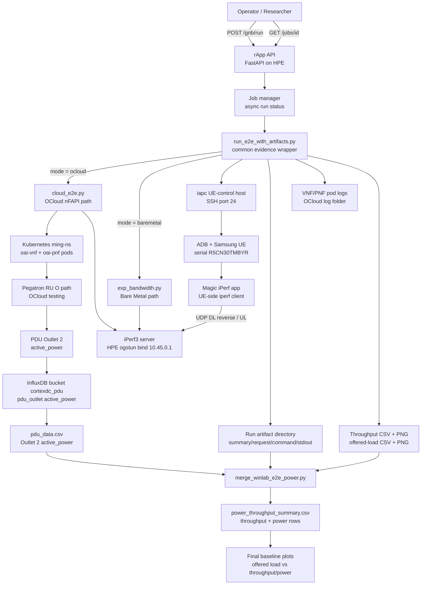

# WINLAB E2E rApp Architecture

**Date:** 2026-07-10  
**Purpose:** Summarize the current rApp architecture for the WINLAB Pegatron RU `[O]` E2E throughput-vs-power workflow.

---

## Architecture Diagram



---

## Main Components

| Component | Current Role |
|---|---|
| rApp API | Receives `/gnb/run` requests and exposes job status through `/jobs/<id>` |
| `run_e2e_with_artifacts.py` | Common wrapper for Bare Metal and OCloud runs; creates one evidence directory per run |
| `cloud_e2e.py` | OCloud nFAPI E2E path using VNF/PNF pods and the Pegatron RU `[O]` path |
| `exp_bandwidth.py` | Bare Metal E2E path inherited from Ming's flow |
| `iapc` | UE-control host; runs ADB commands and controls the Android UE/Magic iPerf client |
| InfluxDB | Provides PDU Outlet 2 `active_power` rows for RU power alignment |
| `merge_winlab_e2e_power.py` | Post-E2E merger that joins rApp throughput artifacts with Outlet 2 power data |

---

## Current Deployment Model

Current host rApp:

```text
127.0.0.1:9090
```

Planned Docker rApp:

```text
127.0.0.1:19090
```

Docker should run beside the current host rApp first. It should not replace or stop the current process until the containerized path is validated.

---

## Data Flow

1. Researcher sends a `/gnb/run` request with mode, bandwidth list, period, UE model, and target identity.
2. rApp starts an async job and calls `run_e2e_with_artifacts.py`.
3. Wrapper runs either OCloud or Bare Metal E2E.
4. HPE runs the local iPerf server on `10.45.0.1`.
5. `iapc` controls the UE and starts the Magic iPerf client.
6. Wrapper collects stdout, command metadata, UE iPerf JSON, VNF/PNF logs, throughput CSV, and plots.
7. Outlet 2 `active_power` is exported from InfluxDB as `pdu_data.csv`.
8. `merge_winlab_e2e_power.py` joins the rApp artifacts with PDU power samples by UTC time window.
9. Final output becomes the throughput-vs-power baseline dataset.

---

## Remaining Architecture Work

| Item | Reason |
|---|---|
| Docker install and validation on HPE | Docker is not available yet on HPE |
| Side-by-side Docker deployment on port `19090` | Prevent disruption to the working host rApp on `9090` |
| `iperf_bind` passthrough | Needed so the runner-side bind address is configurable instead of fixed to HPE defaults |
| Longer clean OCloud sweep | Needed because PDU samples are about once per minute and short tests give weak power statistics |
| Automatic Influx export integration | Currently power CSV export is manual/API-based; final pipeline should automate it or clearly accept a provided `pdu_data.csv` |
