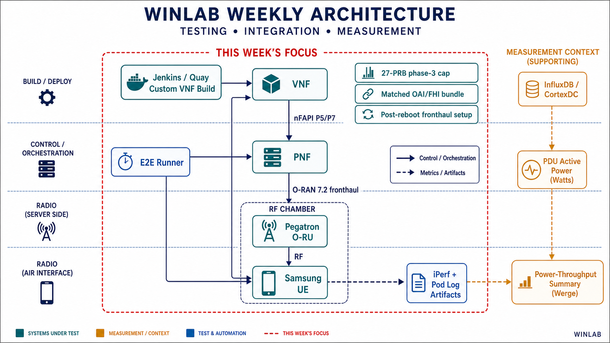

# WINLAB Presentation Run Sheet

**Presentation date:** 2026-07-30  
**Purpose:** Show the professor the concrete implementation, evidence, and next
experiment after the weekly summary.



## 1. Notes and Architecture

Highlight:

- Jenkins and Quay build the VNF image containing the NR MAC scheduler.
- VNF and PNF communicate through nFAPI P5/P7.
- PNF uses the Lavoisier host OAI/FHI/DPDK runtime to drive the Pegatron O-RU.
- The bare-metal rApp controls the test and retains iPerf plus pod-log artifacts.
- CortexDC/InfluxDB supplies independent PDU active-power data for the merge.

## 2. Show the Source Lineage

On HPE:

```bash
ssh hpe@192.168.8.26
cd /home/hpe/openairinterface5g

git log --oneline --decorate -3 d7c850098a
git show --stat 31c7aa0477
git show --stat d7c850098a
```

Highlight:

```text
5bbf48af2d  baseline parent
31c7aa0477  logging-only instrumentation
d7c850098a  27-PRB phase-3 cap
```

Only these scheduler files changed:

```text
openair2/LAYER2/NR_MAC_gNB/gNB_scheduler_dlsch.c
openair2/LAYER2/NR_MAC_gNB/gNB_scheduler_dlsch_default_policies.c
```

This is the key failure-attribution point: the experiment did not directly
change RACH, PRACH, RRC, nFAPI transport, NGAP, AMF, PNF, or xRAN code.

## 3. Show the 27-PRB Change

Use the commit directly so the demonstration does not depend on the currently
checked-out branch:

```bash
git diff 31c7aa0477..d7c850098a -- \
  openair2/LAYER2/NR_MAC_gNB/gNB_scheduler_dlsch_default_policies.c
```

For surrounding context:

```bash
git show \
  d7c850098a:openair2/LAYER2/NR_MAC_gNB/gNB_scheduler_dlsch_default_policies.c \
  | nl -ba | sed -n '186,285p'
```

Highlight:

- Phase 1 keeps HARQ retransmission allocation unchanged.
- Phase 2 keeps control-only work and its five-RB minimum unchanged.
- Phase 3 handles new downlink RLC data.
- The experiment limits phase 3 with:

```c
const int max_new_data_rbSize = 27;
max_rbSize = min(max_rbSize, max_new_data_rbSize);
```

27 is a maximum. The scheduler may assign fewer PRBs for a small
payload.

## 4. Show Scheduler Wiring and Safety

Show the callback selected by OAI:

```bash
git show d7c850098a:openair2/LAYER2/NR_MAC_gNB/main.c \
  | grep -n 'dl_rb_alloc'
```

Show the existing allocation validation path:

```bash
git show d7c850098a:openair2/LAYER2/NR_MAC_gNB/mac_proto.h \
  | nl -ba | sed -n '478,497p'
```

Highlight:

- `nr_dl_proportional_fair` is the active PRB-allocation callback.
- The patch still allocates through `COMMIT_ALLOC()`.
- Existing CCE/PUCCH validation and VRB-map accounting are preserved.

Show why an attachment smoke test is still needed:

```bash
git show d7c850098a:openair2/LAYER2/NR_MAC_gNB/gNB_scheduler_dlsch.c \
  | nl -ba | sed -n '302,343p'
```

`update_dlsch_buffer()` aggregates all active RLC logical channels. Therefore,
the phase-3 cap can also constrain post-RACH SRB/RRC payload grants even though
RACH and RRC source files were not modified.

## 5. Show Scheduler Telemetry

```bash
git show d7c850098a:openair2/LAYER2/NR_MAC_gNB/gNB_scheduler_dlsch.c \
  | nl -ba | sed -n '830,888p'
```

Highlight the `[WINLAB_SCHED_LOG]` record and its useful fields:

- mode;
- frame and slot;
- RNTI;
- new transmission versus retransmission;
- RB start and RB size;
- MCS and TBS;
- HARQ process.

This telemetry is how the 27-PRB claim will be tested, rather than inferred
from offered iPerf load.

## 6. Explain the VNF/PNF Runtime Split

```bash
grep -nE \
  'hostPath|oaiBuildRoot|fhiLibDir|dpdkLibDir|dpdkDriverDir|nr-softmodem' \
  /home/hpe/CRAN/ocloud-helm-templates/oai-pnf/templates/deployment.yaml \
  /home/hpe/CRAN/ocloud-helm-templates/oai-pnf/values.yaml
```

Highlight:

- VNF behavior comes from the Jenkins-built container image.
- PNF starts a worker-mounted `nr-softmodem`.
- PNF also loads worker-mounted FHI/xRAN and DPDK libraries.
- A healthy scheduler image cannot repair an incompatible PNF host bundle.

This explains why the ABI crash, xRAN timing failures, and PRACH segmentation
assertion were investigated separately from the scheduler patch.

## 7. Show a Proven Custom-Image Artifact

The logging-only custom image is the strongest completed evidence:

```bash
ART=/home/hpe/winlab_e2e_rapp/runs/winlab_e2e_rapp/e2e-ocloud-20260723-053441

jq . "$ART/summary.json"
wc -l "$ART/iperf_timeseries.csv"
rg -n '\[WINLAB_SCHED_LOG\]' "$ART" | head
rg '\[WINLAB_SCHED_LOG\]' "$ART" | wc -l
rg '\[WINLAB_SCHED_LOG\].*is_retx=1' "$ART" | wc -l
```

Highlight:

```text
Return code:             0
UE throughput samples:  300
Scheduler records:      13,092
New transmissions:      12,647
Retransmissions:        445
Observed RB size:        5 to 243
```

This proves that a custom scheduler image can attach, carry 200 Mbps traffic,
and generate usable allocation telemetry.

## 8. Show E2E Automation and Power Merge

E2E orchestration on HPE:

```bash
less /home/hpe/winlab_e2e_rapp/scripts/run_e2e_with_artifacts.py
less /home/hpe/CRAN/ocloud-helm-templates/cloud_e2e.py
```

Search inside `less` with:

```text
/artifact
/ensure_online
/iperf
/kubectl
```

Power/throughput merge on the local workstation:

```bash
exit
cd /home/noobplatinum/Videos/TEEP

less scripts/merge_winlab_e2e_power.py
rg -n 'build_step_windows|summarize_power|avg_power_w|rx_throughput' \
  scripts/merge_winlab_e2e_power.py
```

Highlight:

- The E2E runner records the exact UTC test window and preserves UE and pod
  evidence.
- The merge script aligns iPerf step windows with Outlet 2 `active_power`
  samples.
- It reports achieved throughput separately from offered load and summarizes
  average/minimum/maximum power with a sample count.

## 9. End with the Next Experiment

State the next gate clearly:

1. One-minute 27-PRB attach and traffic smoke test.
2. Five-minute run proving every new transmission has `rbSize <= 27`.
3. Twenty-minute stability run with complete throughput, scheduler, pod, and
   power artifacts.

After those pass, implement larger scheduler behavior as runtime-selectable
modes in one binary:

```text
baseline
prb_cap_spread
wide_burst
```

The scientific comparison should use the same source base, image digest,
PNF/FHI bundle, RU configuration, UE position, offered load, and measurement
window. Only the scheduler mode should change.

## Questions

1. Should the primary optimization target be total active power, energy per
   delivered bit, or both?
2. For the next scheduler phase, should the first comparison prioritize
   `prb_cap_spread` versus `wide_burst`, or include a third adaptive mode?
