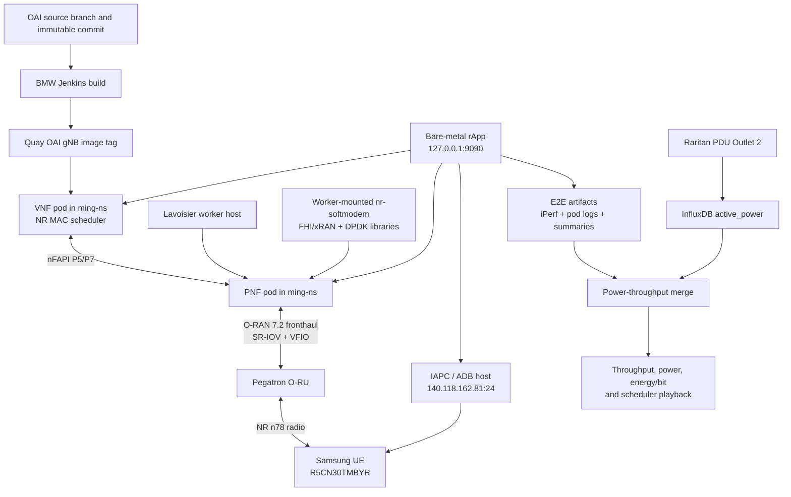

# WINLAB OAI Scheduler Experiment: Session Handoff

**Date:** 2026-08-03  
**Status:** Start-here document for the next working session  
**Scope:** Current research question, lab architecture, recovery runbook, scheduler changes, measurement workflow, known failures, and next experiments

## 1. Read This First

The research target is:

> Measure how OAI downlink scheduler resource allocation changes Pegatron O-RU active power, delivered UE throughput, and energy per delivered bit.

The current experiment uses one physical Samsung UE. It is not a 100-UE capacity experiment. The independent variable is the scheduler's downlink PRB allocation policy; the principal dependent variables are:

- delivered downlink throughput;
- Pegatron O-RU active power from Raritan PDU Outlet 2;
- energy per delivered bit;
- scheduler grant size, MCS, TBS, HARQ, and retransmission behavior;
- run completeness and radio stability.

The most important architectural fact is that VNF and PNF do not obtain all their code from the same image:

- **VNF:** runs the NR MAC scheduler from the Jenkins-built Quay container image.
- **PNF:** launches a worker-mounted `nr-softmodem` and worker-mounted FHI/xRAN and DPDK libraries from Lavoisier.

Consequently, a VNF scheduler image can be correct while the PNF fails because of worker runtime, VFIO, SR-IOV, fronthaul timing, or RU configuration.

## 2. Current Scientific State

### Proven

1. A logging-only custom VNF image completed a five-minute E2E run and emitted scheduler records.
2. The 27-PRB VNF image attached the Samsung UE and carried real traffic.
3. Live scheduler logs proved that no observed grant exceeded 27 PRBs.
4. In the dense scheduler capture, 13,725 of 13,726 grants used 27 PRBs; one used 5 PRBs.
5. A 200 Mbps capped run produced approximately 95.910 Mbps mean received throughput and 40.129 W mean Outlet 2 active power over its positive-traffic window.
6. A repaired PNF completed a 200 Mbps, 60-second E2E smoke test with 60 samples and no sender-reported packet loss.
7. A 500 Mbps request produced 1,115 seconds of positive traffic out of 1,200 requested. This is a useful 92.9% measurement window, but not a clean full-duration pass.
8. The local scheduler playback dashboard uses measured scheduler, throughput, and PDU data without pretending that independently timestamped sources are exactly aligned.

### Not Yet Proven

1. The 27-PRB policy saves RU power relative to a same-day immutable baseline.
2. The system can complete repeated 20- or 30-minute high-load runs without UE client interruption.
3. The 54-PRB and 106-PRB variants have been built and validated in the same controlled setup.
4. Scheduler grants, iPerf samples, and PDU samples have exact shared timestamps. The current scheduler log is process-relative and copied from a rotated pod-log tail.

### Last Known Transient State

This is historical state, not a guarantee of current cluster state:

- PNF deployment: `oai-pnf-pegatron`
- PNF image: `bmw.ece.ntust.edu.tw/minghong/oai-gnb:latest`
- VNF deployment: `oai-vnf`
- VNF image: `bmw.ece.ntust.edu.tw/minghong/oai-gnb:david-oai-prb-cap-27-20260723`
- Both pods were `1/1 Running` with zero restarts after an ordered restart.
- Last submitted job: `35bd1f2b-9b34-46fa-8135-3c6ca1ae6a8c`
- Last job request: 500 Mbps downlink for 1,800 seconds.

Always re-check live state before acting.

## 3. Architecture



## 4. Fixed Lab Identifiers

| Item | Value |
|---|---|
| HPE host | `hpe@192.168.8.26` |
| Kubernetes worker | `lavoisier` |
| Lavoisier SSH alias from HPE | `ssh super` |
| Lavoisier BMC | `https://192.168.10.92/` |
| Kubeconfig | `/home/hpe/CRAN/ming-kubeconfig.yaml` |
| Kubectl binary | `/home/hpe/CRAN/kubectl` |
| Namespace | `ming-ns` |
| Helm releases | `pnf`, `vnf` |
| Deployments | `oai-pnf-pegatron`, `oai-vnf` |
| Bare-metal rApp | `http://127.0.0.1:9090` |
| Samsung serial | `R5CN30TMBYR` |
| IAPC/ADB host | `sshuser@140.118.162.81`, port `24` |
| Expected UE data subnet | `10.45.x.x` |
| Local iPerf server | `10.45.0.1:5201` |
| Expected OAI cell | ARFCN `649920`, PCI `0`, PLMN `001-01` |
| RU power source | InfluxDB bucket `cortexdc_pdu`, Outlet 2 |
| RU PDU selector | `pdu_ip=192.168.10.72`, `sensor_id=16`, `sensor_name=Outlet 2` |

Do not store passwords, Influx tokens, GitHub PATs, or registry credentials in this document. A GitHub token appeared in an earlier remote URL transcript; rotate it if that credential has not already been replaced. Avoid printing credential-bearing remote URLs in future notes.

## 5. Code and Artifact Locations

### Local workspace

```text
/home/noobplatinum/Videos/TEEP
```

Important files:

```text
scripts/merge_winlab_e2e_power.py
scripts/build_winlab_scheduler_playback.py
assets/winlab_scheduler_playback/index.html
pnf-group-fallback.patch
runs/hpe_artifacts/
docs/StudyNotes/
docs/DailyNotes/
```

### HPE

```text
/home/hpe/CRAN/ocloud-helm-templates/oai-pnf
/home/hpe/CRAN/ocloud-helm-templates/oai-vnf
/home/hpe/winlab_e2e_rapp
/home/hpe/winlab_e2e_rapp/scripts/run_e2e_with_artifacts.py
/home/hpe/CRAN/ocloud-helm-templates/cloud_e2e.py
/home/hpe/openairinterface5g
```

### Lavoisier worker runtime

Active runtime roots are selected by PNF Helm values. Historically relevant roots include:

```text
/home/oai72_su/oai_mp_f_ming
/home/oai72_su/oai_mp_f_ming/experiments/k-pristine-20260724
```

The preserved matched FHI library root is:

```text
/home/oai72_su/oai_mp_f_ming/experiments/k-pristine-20260724/xran-package-shim/fhi_lib/lib/build
```

Do not replace only `nr-softmodem` without its matching libraries. Partial runtime rollback produced ABI and PRACH failures.

## 6. Scheduler Source and Image Lineage

Main scheduler files:

```text
openair2/LAYER2/NR_MAC_gNB/gNB_scheduler_dlsch.c
openair2/LAYER2/NR_MAC_gNB/gNB_scheduler_dlsch_default_policies.c
```

The active downlink allocation callback is `nr_dl_proportional_fair`. The scheduler pipeline collects UE candidates, selects radio parameters, calls the PRB allocation callback, and finalizes the PDSCH through existing validation and VRB-map accounting.

Known lineage:

| Purpose | Commit / image |
|---|---|
| Logging-only source | `31c7aa0477586643a7acdae9c316c61c1ba0cdbf` |
| Logging-only image | `david-oai-scheduler-logonly-20260721` |
| 27-PRB source | `d7c850098ac96f89a04695e6342ceca8ec757555` |
| 27-PRB image | `david-oai-prb-cap-27-20260723` |

The 27-PRB patch applies only to phase-3 new downlink RLC data:

```c
const int max_new_data_rbSize = 27;
max_rbSize = min(max_rbSize, max_new_data_rbSize);
```

It is a maximum, not a fixed grant. HARQ retransmissions and control-only work retain their existing paths. Because OAI aggregates active RLC logical-channel buffers, the cap can also constrain post-RACH downlink signaling carried through RLC, but it does not alter PRACH, RACH, xRAN, NGAP, or AMF code.

Scheduler evidence is emitted with:

```text
[WINLAB_SCHED_LOG]
```

Useful fields include mode, frame, slot, RNTI, retransmission flag, RB start, RB size, MCS, TBS, layers, HARQ PID, beam, TDA, and symbols.

## 7. PNF Compatibility Patch

The repaired worker PNF had aborted after PRACH with:

```text
Assertion (g >= 0) failed!
Ungrouped ULSCH_id 0
```

The local patch is `pnf-group-fallback.patch`. It changes `group_pusch_jobs()` in:

```text
openair1/SCHED_NR/phy_procedures_nr_gNB.c
```

It preserves every valid MU-MIMO group index and assigns only legacy jobs with `mu_group_idx < 0` to unused local fallback groups. This is a PNF compatibility repair, not a scheduler policy change.

Keep this patch and its rebuilt worker binary auditable separately from VNF scheduler commits.

## 8. Live Preflight

SSH to HPE and define the command variables:

```bash
ssh hpe@192.168.8.26

K=/home/hpe/CRAN/kubectl
C=/home/hpe/CRAN/ming-kubeconfig.yaml
N=ming-ns
```

Check the worker, SR-IOV resources, pods, restart counts, and exact images:

```bash
$K --kubeconfig="$C" get node lavoisier -o wide

$K --kubeconfig="$C" get node lavoisier \
  -o jsonpath='cp={.status.allocatable.openshift\.io/fh_sriov_cp_lao} up={.status.allocatable.openshift\.io/fh_sriov_up_lao}{"\n"}'

$K --kubeconfig="$C" get pods -n "$N" -o wide \
  | grep -E 'oai-pnf|oai-vnf'

$K --kubeconfig="$C" get deploy -n "$N" \
  -o jsonpath='{range .items[?(@.metadata.name=="oai-pnf-pegatron")]}PNF={.spec.template.spec.containers[0].image}{"\n"}{end}{range .items[?(@.metadata.name=="oai-vnf")]}VNF={.spec.template.spec.containers[0].image}{"\n"}{end}'

curl -fsS http://127.0.0.1:9090/health
```

Required before a serious run:

- `lavoisier` is `Ready`;
- SR-IOV CP and UP allocatable are both `1`;
- exactly one PNF and one VNF pod are `1/1 Running`;
- restart counts remain stable for several minutes;
- PNF and VNF images match the intended condition;
- no other reservation is using the same RU or UE;
- Nemo shows the expected OAI cell;
- the Samsung UE has a `10.45.x.x` address before a preserve-state run.

## 9. Ordered Pod Restart

Use PNF first, then VNF. This clears stale nFAPI sessions while allowing the lower radio path to settle first.

```bash
$K --kubeconfig="$C" scale deploy oai-vnf -n "$N" --replicas=0
$K --kubeconfig="$C" scale deploy oai-pnf-pegatron -n "$N" --replicas=0
$K --kubeconfig="$C" wait --for=delete pod -n "$N" -l app=oai-gnb --timeout=90s || true

$K --kubeconfig="$C" scale deploy oai-pnf-pegatron -n "$N" --replicas=1
$K --kubeconfig="$C" rollout status deploy/oai-pnf-pegatron -n "$N" --timeout=180s
sleep 15

$K --kubeconfig="$C" scale deploy oai-vnf -n "$N" --replicas=1
$K --kubeconfig="$C" rollout status deploy/oai-vnf -n "$N" --timeout=180s
```

Do not repeatedly delete individual replica pods while the deployment remains at one replica. That produced `UnexpectedAdmissionError` clutter and obscured the real state. Scale the owning deployment.

## 10. Recovery Decision Tree

### A. Lavoisier is `NotReady`

From HPE:

```bash
ssh super 'sudo systemctl start kubelet; systemctl is-active kubelet'
$K --kubeconfig="$C" get node lavoisier
```

If SSH is unreachable, use the Lavoisier BMC at `https://192.168.10.92/`. After a BMC reboot, continue with the fronthaul setup below before starting PNF.

### B. Lavoisier was rebooted or fronthaul/VF state is invalid

Scale PNF to zero first because the setup script destroys and recreates SR-IOV VFs:

```bash
$K --kubeconfig="$C" scale deploy oai-pnf-pegatron -n "$N" --replicas=0
ssh super '/home/oai72_su/Script/setup_network.sh enp67s0f1'
ssh super 'sudo systemctl start kubelet; systemctl is-active kubelet'
```

The script restores VLANs, addresses, routes, MTU, VFs, VFIO binding, and performance settings. Never run it while an active PNF owns the VFIO group.

### C. SR-IOV UP allocatable is `0`

On Lavoisier, verify the device plugin and restart its CRI container if it has lost synchronization:

```bash
sudo crictl ps --name sriov
CID=$(sudo crictl ps --name sriov -q | head -n1)
sudo crictl stop "$CID"
```

Then re-check:

```bash
$K --kubeconfig="$C" get node lavoisier \
  -o jsonpath='{.status.allocatable.openshift\.io/fh_sriov_up_lao}{"\n"}'
```

### D. RU was used, moved, or reconfigured by another experiment

Only then run the RU recovery sequence on Lavoisier:

```bash
ssh super
rrr
# Wait for the RU to finish rebooting.
pegam
```

`rrr`/`pegam` restore the RU. They do not replace Lavoisier's fronthaul setup script and are not required before every run.

The underlying Pegatron M-plane script is:

```text
/home/hpe/SMO-Mplane/Pegatron/Mplane_pega.sh
```

### E. PNF crashes after PRACH

Inspect current and previous logs before changing anything:

```bash
PNF=$($K --kubeconfig="$C" get pod -n "$N" -o name \
  | grep '^pod/oai-pnf-' | head -n1 | cut -d/ -f2)

$K --kubeconfig="$C" logs -n "$N" "$PNF" --tail=250
$K --kubeconfig="$C" logs -n "$N" "$PNF" --previous --tail=250
```

Recognized signatures:

| Signature | Meaning / response |
|---|---|
| `Ungrouped ULSCH_id` / `g >= 0` | Worker PNF grouping incompatibility; verify the fallback patch and matched build. |
| `PRACH segmentation is not supported` | RU packetization/profile or host FHI compatibility problem; restore expected RU config and matched PNF/FHI bundle. |
| `xran_timingsource_poll_next_tick too long` | Fronthaul/real-time timing collapse; check post-reboot setup and worker health. |
| nFAPI requests hundreds of ms early | Invalid PNF/VNF/RU timing chain, not an iPerf issue. |
| SIGSEGV in host `nr-softmodem` | Worker binary/library mismatch; do not blame the VNF scheduler image. |
| exit 137 without OOM/assert/coredump | Likely external pod/runtime disruption; verify node events and restart cleanly. |

### F. Cell is visible but UE has no IP

Use Nemo Handy:

- **NR Cell Table:** expect ARFCN `649920`, PCI `0`.
- **Signaling -> SIB1 details:** expect PLMN MCC `001`, MNC `01`.

If the cell is absent, diagnose PNF/RU/fronthaul. If the expected cell is visible but attach never progresses, inspect VNF RRC/NGAP/nFAPI logs and shared-lab conflicts. Do not restart Open5GS solely because the phone lacks an IP; require AMF/NGAP evidence first.

An IP alone is also insufficient. It can be stale or belong to another active cell/session. Confirm the expected Nemo cell and then validate traffic to `10.45.0.1:5201`.

## 11. Selecting Scheduler Images

Keep PNF on its intended compatible image/runtime. Change the VNF image for scheduler experiments.

27-PRB VNF:

```bash
$K --kubeconfig="$C" set image deploy/oai-vnf -n "$N" \
  gnb=bmw.ece.ntust.edu.tw/minghong/oai-gnb:david-oai-prb-cap-27-20260723

$K --kubeconfig="$C" rollout status deploy/oai-vnf -n "$N" --timeout=180s
```

Moving `latest` is useful for operational recovery but is not an acceptable scientific baseline. Build or identify an immutable baseline tag from the exact parent commit used by the scheduler variants and record its digest.

For every run, record:

- source repository and commit;
- Jenkins build number/URL;
- complete image reference and digest;
- Helm release revision and values;
- pod image IDs;
- rApp job ID and artifact directory;
- Influx export and merged output.

## 12. Running E2E

### Preferred when the UE is already attached

Use preserve-state mode so the endpoint does not toggle airplane mode and destroy a known-good attach:

```bash
curl -sS -X POST http://127.0.0.1:9090/gnb/run \
  -H 'Content-Type: application/json' \
  -d '{
    "mode": "ocloud",
    "server": "hpe",
    "target_identity": "hpe-pegatron-ru-o",
    "ue_serial": "R5CN30TMBYR",
    "iapc_host": "sshuser@140.118.162.81",
    "iapc_port": 24,
    "bandwidth": [500],
    "period": 1200,
    "gap_time": 2,
    "ue_model": "samsung",
    "uplink": false,
    "settle_time": 30,
    "attach_timeout": 120,
    "preserve_ue_state": true,
    "keep_ue_online_on_failure": true
  }'
```

Before relying on `preserve_ue_state`, verify that the live `9090` API schema still accepts it. The active rApp may change between sessions.

### Poll once when requested

```bash
curl http://127.0.0.1:9090/jobs/JOB_ID
```

Do not continuously poll unless monitoring was explicitly requested. Job state has historically been in-memory, so restarting the rApp can make an old job return `job not found` even when its artifact directory remains on disk.

## 13. Run Acceptance

Do not accept a run only because the API says `succeeded`, both pods are `1/1`, or the UE retains an IP.

A valid run should establish:

1. The requested VNF image and PNF runtime were active.
2. PNF and VNF remained Ready with stable restart counts.
3. The expected OAI cell and UE attach were observed.
4. The local iPerf server accepted a real UE connection.
5. UE throughput samples cover at least 80% of the requested duration; prefer 100% for final comparisons.
6. Scheduler logs contain the expected mode and grant behavior.
7. PDU data overlap the actual positive-traffic window.
8. No fatal PNF assertion, UE idle-timeout truncation, or client interruption invalidates the claim.

The runner was hardened to save expected duration, observed duration, completion ratio, validation errors, and warnings. Keep partial runs as diagnostic evidence, but label them honestly.

## 14. Power Export and Merge

Export Raritan Outlet 2 `active_power` for the run's UTC interval. Keep the Influx token in the shell environment, not in scripts or notes.

```bash
curl --request POST \
  'http://192.168.8.48:8086/api/v2/query?orgID=d346b4cdcce3e360' \
  --header "Authorization: Token $INFLUX_TOKEN" \
  --header 'Accept: application/csv' \
  --header 'Content-Type: application/vnd.flux' \
  --data 'from(bucket: "cortexdc_pdu")
    |> range(start: START_UTC, stop: STOP_UTC)
    |> filter(fn: (r) => r["_measurement"] == "pdu_outlet")
    |> filter(fn: (r) => r["_field"] == "active_power")
    |> filter(fn: (r) => r["asset_id"] == "17")
    |> filter(fn: (r) => r["category"] == "outlet")
    |> filter(fn: (r) => r["pdu_ip"] == "192.168.10.72")
    |> filter(fn: (r) => r["sensor_id"] == "16")
    |> filter(fn: (r) => r["sensor_name"] == "Outlet 2")' \
  > pdu_data_RUN.csv
```

Fetch the HPE artifact locally, then merge:

```bash
python3 scripts/merge_winlab_e2e_power.py \
  runs/hpe_artifacts/e2e-ocloud-RUN \
  pdu_data_RUN.csv \
  -o power_throughput_summary_RUN.csv
```

The merge script clips the analysis at the final positive-throughput interval so post-failure idle power does not contaminate the traffic average.

## 15. Scheduler Playback

Open locally:

```text
assets/winlab_scheduler_playback/index.html
```

Rebuild its data with:

```bash
python3 scripts/build_winlab_scheduler_playback.py \
  runs/hpe_artifacts/e2e-ocloud-20260730-064034 \
  pdu_data_20260730_063800_070400.csv \
  -o assets/winlab_scheduler_playback/data/run-data.js
```

The upper playback uses a dense scheduler capture. The lower chart uses the full measured throughput and power timeline. Do not claim exact alignment until a shared run marker or dedicated timestamped scheduler trace is implemented.

## 16. Next Experiment

The next meaningful experiment is a same-session scheduler allocation sweep under enough offered load to make each cap active.

Recommended controlled matrix:

| Condition | Offered load | Duration | Purpose |
|---|---:|---:|---|
| Immutable baseline / 273 PRBs | 500 Mbps | 20 min | Control condition |
| 27-PRB cap | 500 Mbps | 20 min | Strong restriction, already functionally validated |
| 54-PRB cap | 500 Mbps | 20 min | Intermediate allocation point |
| 106-PRB cap | 500 Mbps | 20 min | Higher intermediate point |

Keep UE, RU, frequency, TDD pattern, radio configuration, offered load, PDU outlet, duration, and acceptance rule constant. Run at least two repetitions per condition if reservation time allows.

For each condition report:

- observed throughput mean and distribution;
- Outlet 2 active power mean, min, max, and variability;
- joules per delivered gigabit;
- PRB grant distribution and cap violations;
- MCS, TBS, HARQ, and retransmission rate;
- positive-traffic duration and completion ratio;
- pod restart counts and relevant failure signatures.

The 54- and 106-PRB points matter because one 27-PRB point only shows that a severe cap reduces throughput. Multiple allocation levels reveal whether RU power is flat, step-like, or load-dependent and provide the beginning of the scheduler-allocation-versus-power curve requested by the professor.

## 17. Engineering Improvements After the Sweep

1. Build baseline, 27, 54, and 106 modes from one immutable parent commit.
2. Prefer one runtime-selectable scheduler image over separate drifting images.
3. Emit scheduler telemetry to a dedicated timestamped file with a unique run ID.
4. Include exact image digests, Helm values, pod UIDs, and restart counts in every artifact summary.
5. Add a preflight endpoint that refuses to run unless node, SR-IOV, pod, cell, UE IP, and iPerf reachability checks pass.
6. Persist rApp job metadata to disk so service restarts do not erase status history.
7. Keep infrastructure compatibility patches separate from scheduler-policy commits.

## 18. Rules That Prevent Repeating the Long Debug Cycle

- Confirm the reservation and physical UE/RU location before touching Kubernetes.
- Do not run `setup_network.sh` while PNF is active.
- Do not run `rrr`/`pegam` before every test; use them only after RU use or configuration drift.
- Do not infer user-plane health from an IP address.
- Do not infer scheduler correctness from offered bandwidth.
- Do not infer scientific validity from API status alone.
- Do not compare an immutable experiment image against a moving `latest` tag.
- Do not replace a worker PNF executable without its matching libraries.
- Do not restart Open5GS without evidence that AMF/core state is the failing layer.
- Do not delete pods one by one when the deployment controller is recreating them; scale the deployment.
- Do not expose Git or Influx credentials in command output, notes, screenshots, or prompts.

## 19. Primary Supporting Notes

Read these only when deeper detail is required:

1. `2026-07-31_WINLAB_Scheduler_Playback_PNF_Compatibility_and_500Mbps_Validation.md`
2. `2026-07-30_27-PRB_Live_Validation_Power_Merge_and_Run_QC.md`
3. `2026-07-31_WINLAB_Single-UE_Scheduler_Playback_Visualization.md`
4. `2026-07-29_OAI_Scheduler_Deep_Dive_Failure_Attribution_and_QC_Plan.md`
5. `2026-07-28_PNF_Runtime_Bundle_Rollback_and_PRACH_Investigation.md`
6. `2026-07-27_Lavoisier_PostReboot_Fronthaul_Recovery_and_Stable_E2E.md`
7. `2026-07-20_WINLAB_OAI_Scheduler_Modification_Workflow.md`
8. `2026-07-30_WINLAB_Presentation_Run_Sheet.md`

## 20. Next-Session Learning Prompt

Use the prompt below to begin a clean session:

```text
We are continuing the WINLAB OAI scheduler-versus-O-RU-power experiment.

Workspace: /home/noobplatinum/Videos/TEEP

First, read this handoff completely:
docs/StudyNotes/2026-08-03_WINLAB_OAI_Scheduler_Experiment_Session_Handoff.md

Treat it as the authoritative starting context. Read the linked supporting notes only when a specific detail is missing. Do not reconstruct the old conversation.

After reading, explain back in a compact checkpoint:
1. the research question and controlled variables;
2. the VNF-image versus PNF-worker-runtime split;
3. what has and has not been scientifically validated;
4. the safe preflight/recovery sequence;
5. the next experiment matrix and acceptance criteria.

Then inspect current local git status and the live HPE state read-only. HPE is hpe@192.168.8.26, kubectl is /home/hpe/CRAN/kubectl, kubeconfig is /home/hpe/CRAN/ming-kubeconfig.yaml, namespace is ming-ns, and the bare-metal rApp is on 127.0.0.1:9090.

Do not mutate the cluster, RU, worker networking, images, UE airplane state, or rApp until I give the current task. Never expose credentials. When I ask to run an experiment, verify reservation, node Ready, SR-IOV CP/UP=1, exact images, stable pod restart counts, expected Nemo cell (ARFCN 649920 / PCI 0 / PLMN 001-01), UE attachment, and rApp health before submission.

The immediate research direction is a controlled 500 Mbps allocation sweep using immutable baseline/273-, 27-, 54-, and 106-PRB conditions, with throughput, scheduler telemetry, Outlet 2 power, energy per delivered bit, and run completeness recorded. Prefer 20-minute runs and 100% completion; 80% is diagnostic-only minimum acceptance.
```
