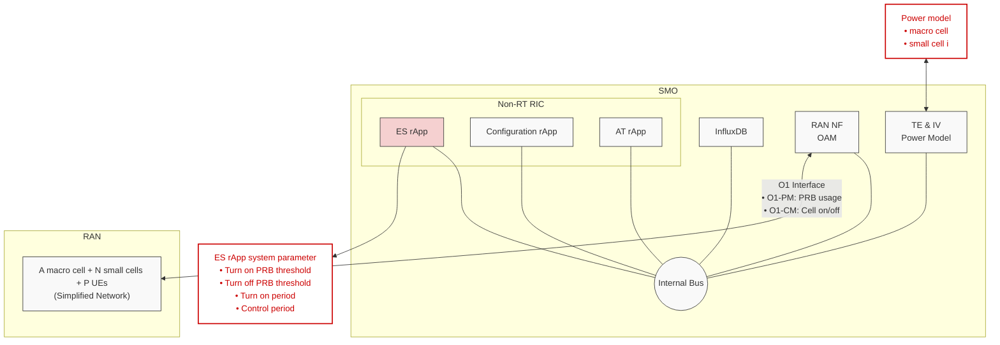
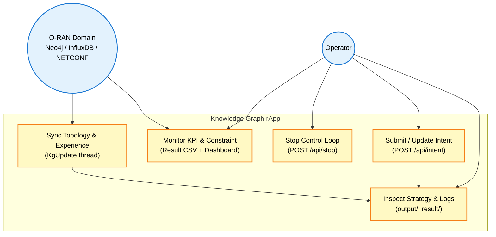
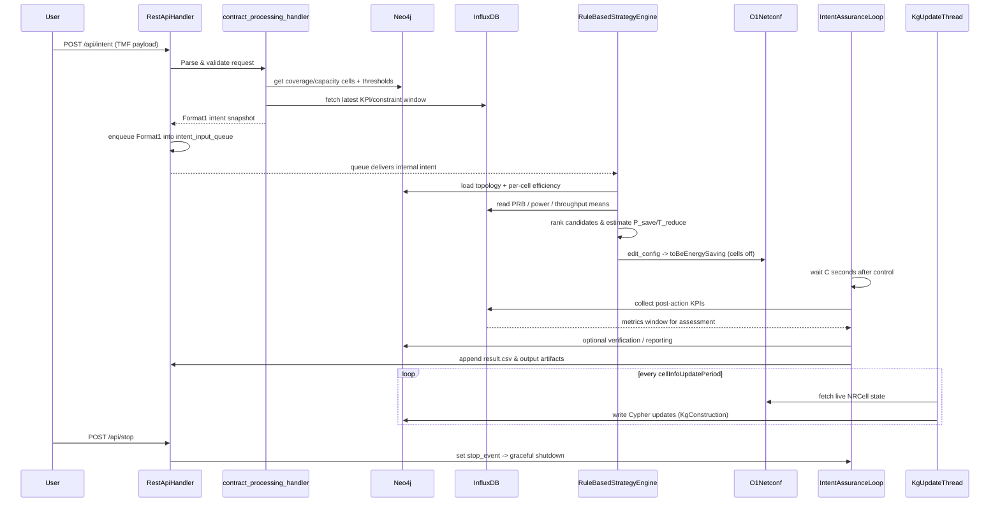
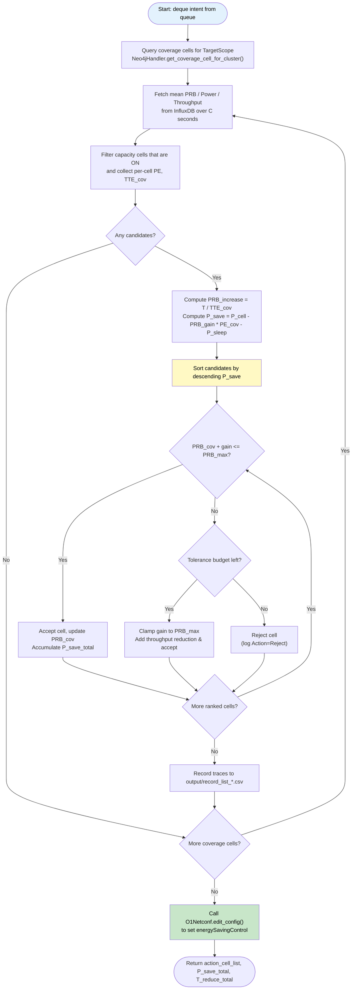
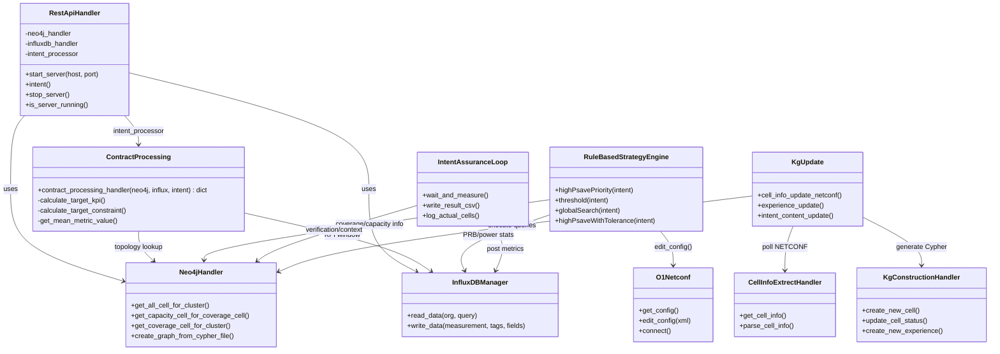
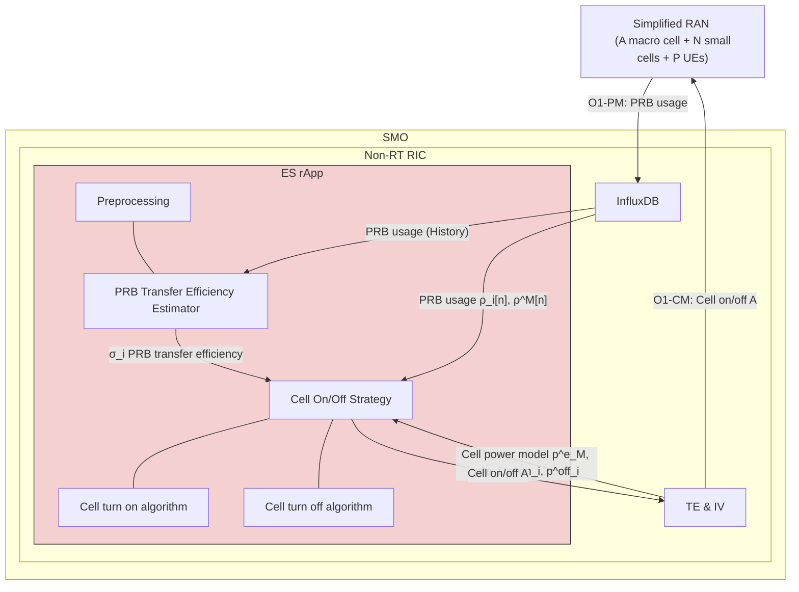
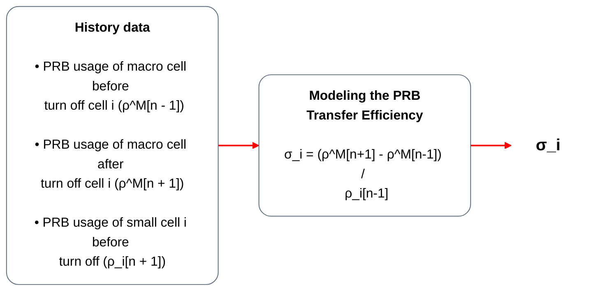

# Cell Switching for Energy Saving in Heterogeneous Small Cell Networks

## Table of Contents
- [1. Introduction](#1-introduction)
- [2. Execution Status](#2-execution-status)
- [3. System Architecture](#3-system-architecture)
- [4. Use Case Diagram](#4-use-case-diagram)
- [5. Message Sequence Chart (MSC)](#5-message-sequence-chart-msc)
- [6. Flowchart](#6-flowchart)
- [7. Class Diagram](#7-class-diagram)
- [8. System Parameters](#8-system-parameters)
- [9. Detailed Design: Proposed Method](#9-detailed-design-proposed-method)
- [ES rApp Implementation & User Guide](#es-rapp-implementation--user-guide)
    - [1. Project Structure](#1-project-structure)
    - [2. Minimum Requirements](#2-minimum-requirements)
    - [3. PRB Transfer Efficiency Estimator](#3-prb-transfer-efficiency-estimator)
    - [4. ES rApp Installation](#4-es-rapp-installation)
        - [4.1 ES rApp download and configuration](#41-es-rapp-download-and-configuration)
        - [4.2 Run the ES rApp](#42-run-the-es-rapp)
    - [Experiment 1: Algorithm Behavior Validation ](#experiment-1-algorithm-behavior-validation)
    - [Experiment 2: Algorithm Comparison under Random Loading](#experiment-2-algorithm-comparison-under-random-loading)
    - [Experiment 3: Cell On/Off Strategy and Thresholds](#experiment-3-cell-onoff-strategy-and-thresholds)
- [References](#references)
- [Appendix](#appendix)


## 1. Introduction
### 1.1 Background & Introduction
In next-generation wireless networks, the massive number of connected devices and the diversity of services significantly increase operational complexity. Concurrently, the ultra-dense deployment of base stations (BSs) has resulted in substantial energy consumption. This issue is particularly during off-peak hours, where a significant amount of energy is wasted by idle BSs [1]. To efficiently reduce BS power consumption, some approach of the energy saving method are proposed. For example, in O-RAN Alliance network energy savings use cases technical report, four methods of Network Energy Saving Use Case are mentioned including RF channel reconfiguration, advanced sleep Mode selection, O-cloud resource energy saving mode and carrier and cell switch off/on [2]. However, the most straightforward approach is to switch off BSs under low-load conditions or when they are not serving any active traffic. However, the primary challenge in energy-saving strategy lies in determining precisely which BSs to deactivate while minimizing the impact on network throughput.
### 1.2 Problem, Challenge, and Contribution

- **Problem**
    - Reduce total power consumption in heterogeneous small cell network by switching on/off small cells without degrading users throughput requirement.

- **Challenge**
    - Cell switch off massive combination in heterogeneous small cells for energy saving.
    - Trade-off between macro cell loading and energy saving.

- **Contribution**
    - A Max-Power-Saving cell turn off algorithm to optimize energy saving.
    - Two threshold cell on/off strategy considering macro cell loading and energy saving.


## 2.Execution Status
> **Status Icons:**
> - ✅ Completed successfully
> - ⏳ In progress / Pending
> - ❌ Error / Failed (with explanation)

| Step                                                                  | Status | Timeline   | 
| --------------------------------------------------------------------- | ------ | ---------- |
| Finish the Data modeling                                              | ✅    | 2026-02-03 |
| Think the new plan for thesis                                         | ✅    | 2026-02-04 |
| Finish the New plan                                                   | ✅    | 2026-03-15 |
| Finish the New code                                                   | ✅    | 2026-03-31 |
| Performance Benchmarking                                              | ✅    | ~2026-04-15~ ~2026-05-30~ 2026-06-18 |
| Finish 30 page slide & Finish 10 pages two column IEEE format paper   | ✅    | ~2026-04-22~ ~2026-05-30~ 2026-06-22|
| Finish 50 pages thesis                                                | ✅    | ~2026-04-30~ ~2026-05-30~ 2026-06-22| 

## 3. System Architecture & System Model




### 3.1 Components Explanation
- [Service Management and Orchestration (SMO)](https://specifications.o-ran.org/download)
    - To effectively manage the RAN domain, the O-RAN architecture leverages the SMO, which is designed fundamentally around Service-Based Architecture (SBA) principles. This design dictates the generation of specific SMO Services (SMOSs). In practice, an SMO Framework (SMOF) is highly adaptable; it can be implemented to produce and/or consume an arbitrary combination of SMOSs[3]. In this paper, we use the following important components are used: Non-RT RIC and RAN NF OAM.
- [Non-Real Time RAN Intelligent Controller (Non-RT RIC)](https://specifications.o-ran.org/download)
    - Within the O-RAN architecture, the Non-RT RIC serves as a core functional entity within the SMO framework. Its primary objective is to facilitate intelligent RAN operations and performance optimization. The Non-RT RIC is fundamentally composed of two main components: the Non-RT RIC Framework and rApps. Specifically, the Non-RT RIC Framework is responsible for logically terminating the A1 interface towards the Near-RT RIC, as well as exposing and provisioning a suite of R1 services to the rApps. By leveraging the functionalities provided by both the SMO and the Non-RT RIC Framework, these rApps deliver services crucial for RAN orchestration and optimization[4].
- [InfluxDB](https://www.influxdata.com/)
    - Time-series database for storing and querying O1 PM metrics (power, PRBs, throughput) with high granularity.
- [RAN Network Function Operation and Maintenance (RAN NF OAM)](https://specifications.o-ran.org/download?id=933)
    - The RAN NF OAM serves as a critical enabler for network orchestration, offering a diverse array of operational functionalities. These encompass core administrative tasks such as Povisioning management, fault Supervision, and performance management. Beyond basic configuration and monitoring, the service supports extensive network telemetry through trace management, real-time streaming, file-based data reporting, and comprehensive log data collection[5]. This is a key component which collects the performance management related metrics and network configuration interface.
- [ES rApp](#detailed-design-proposed-method)
    - ES rApp is the core component in this paper. Through retrieve the necessary network measurement performance metrics (i.e. power consumption, throughput and PRB useage) from influxDB, it determines cell on/off cell for maximum the energy saving with ensuring throughput requirements. The detain algorithm of the ES rApp will be introduced in the Section~\ref{sec:PowerOptimalStrategy}.

### 3.2 System Model
#### 3.2.1 Power Model
For a BS $i$ in the active state, we adopt a generalized power consumption model comprising both fixed and dynamic components. Based on public research from the O-RAN Plugfest, the power consumption $P_i$ of a BS can be expressed as:

- $P_i = p^e_i(\rho_i) + p^b_i= \frac{(\alpha_i + \frac{P^{tx}_i}{\eta_i})}{\rho^{max}_i} \cdot \rho_i + p^b_i$

where, $P^e_i(\rho_i)$ denotes the dynamic power efficiency of the BS, which varies with PRB usage $\rho_i$. It is determined by the additional processing overhead power $\alpha_i$, the transmit power $P^{tx}_i$, and the power amplifier efficiency $\eta_i$ of the BS $i$. $P^b_i$ represents the baseline power consumption when the BS is active but handling no traffic. Consistent with previous studies, a linear relationship for power efficiency is widely adopted for BSs. Furthermore, when a cell is inactive, the BS hardware still consumes a baseline amount of power. Therefore, a sleep-mode power consumption $P^{off}_i $ is accounted for when a cell is turned off. Consequently, the simplified power consumption model can be summarized:
- $P_i = p^e_i \cdot \rho_i + p^b_i , \text{if cell } i \text{ is active}$
- $P_i = p^{off}_i         , \text{otherwise}$
#### 3.2.2 PRB Transfer Efficiency
To ensure the macro cell can accommodate the additional traffic when small cells are turned off, the PRB transfer efficiency plays a crucial role in estimating the resulting PRB usage at the macro cell. Assuming UEs are normally distributed within the small cells over a long time scale, we can approximate their locations as being concentrated near the cell center. Moreover, for a fixed location and assuming a stable channel, the Signal-to-Interference-plus-Noise Ratio (SINR) remains constant, resulting in an unchanged Modulation and Coding Scheme (MCS) for a given UE. Consequently, we can estimate PRB usage based on the distance between the macro cell and each small cell. We formulate the throughput of cell $i$ as $T_i = R_{i} * \rho_i$, where $\rho_i$ is the PRB usage and $R_{i}$ represents the throughput per PRB for cell $i$.

Macro cells provide broad coverage using high transmit power, whereas small cells serve limited areas with lower transmit power. Due to the significant difference in transmit power, a small cell $i$ and its associated UEs can be modeled as a single point load from the perspective of the macro cell. Therefore, when small cell $i$ is turned off, its total throughput demand $T_i$ is offloaded to the macro cell, assuming the demand originates from the small cell's center. This offloaded throughput can be expressed as $T_i = R^M_i \cdot \rho^M_i$, where $R^M_i$ and $\rho^M_i$ represent the throughput per PRB from macro cell and the number of PRBs provided by the macro cell, respectively.

To maintain the same throughput before and after offloading, we have $T_i = R_i \cdot \rho_i = R^M_i \cdot \rho^M_i$. From this, the required number of macro cell PRBs can be derived as $\rho^M_i = \rho_i \cdot \left(\frac{R_i}{R^M_i}\right)$. Consequently, the PRB Transfer Efficiency ratio, denoted as $\sigma_i$, upon turning off cell $i$ is defined:

- $\sigma_i = \frac{R_i}{R^M_i}$

$Proof: T_i = R_{i} \cdot \rho_i =  R^M_i \cdot \rho^M_i\\$
$\rightarrow \quad \rho^M_i = \rho_i \cdot \frac{R_i}{R^M_i}\\$
$\rightarrow \quad \sigma_i = \frac{R_i}{R_i^M} = \frac{\rho_i^M}{\rho_i}$

## 4. Use Case Diagram



## 5. Message Sequence Chart (MSC)

This MSC shows the flow from User Intent to Network Control and Experience Update.



## 6. Flowchart



## 7. Class Diagram



## 8. System Parameters
the transmission power of the $i$-th small cell ($P_i$) and the macro cell ($P^M$), the number of Physical Resource Blocks (PRBs) utilized by the $i$-th small cell ($\rho_i$) and the macro cell ($\rho^M$), and the throughput of the $i$-th small cell ($T_i$).
| Category               | Parameter              | Type    | Unit                                                | 3GPP Spec                                      | Description           |
| ---------------------- | ---------------------- | ------- | --------------------------------------------------- | ---------------------------------------------- | --------------------------------------- |
| **O1 PM cell metrics** |                  |     |                                                 |  |       |
| macro cell ($P^M$) and small cell ($P_i$) | `PEE.AvgPower`         | Float   | Watts                                               | [TS 28.552 §5.1.1.19.2.1](https://www.3gpp.org)| Average power consumed over the measurement period    |
|      small cell ($T_i$)                  | `DRB.UEThpDl`          | Float   | Mbps                                                | [TS 28.552 §5.1.1.3.1](https://www.3gpp.org)   | Average downlink throughput   |
|      small cell ($\rho_i$) and the macro cell ($\rho^M$)                  | `RRU.PrbUsedDl`        | Float   | #                                                   | [TS 28.552 §5.1.1.2.5](https://www.3gpp.org)   | Mean downlink Physical Resource Blocks (PRBs) used for data traffic.  |\
| **O1 CM control**      |   |   |          |        |  |
| Cell on/off action ($A$)      | `energySavingControl`  | String  | `toBeEnergySaving` or `toBeNotEnergySaving`         | [TS 38.331 §6.2.2](https://www.3gpp.org)       | Cell activation command |

## 9. Detailed Design: Proposed Method



### 9.1 Flow of PRB Transfer Efficiency Estimator




### 9.2 Cell On/Off Strategy

#### 9.2.1 Hyperparameter
|Parameter |Discription |Range / Unit |
| --- | --- | --- |
|$\mu_{off}$ |PRB threshold of the macro cell for cell turn off  |None|
|$\mu_{on}$ |PRB threshold of the macro cell for cell turn on  |None|
|$\delta$ |Control period  |Second|
|$\delta_{on}$ |Cell turn on detect period  |Second|

#### 9.2.2 Cell Turn Off Algorithm
$$
\begin{array}{l}
\textbf{Algorithm: } \text{MPS} \\
\hline
\textbf{Require: } P_i^e, P_i^b, P_M^e, \sigma_i, \mu_{off}, \rho_i[n], \rho^M[n] \text{ and } P_i^{off} \\
\textbf{Ensure: } \text{Set of cells to be turned off, } A \\
1: \text{Initialize } C_s \text{ as the set of all active cells} \\
2: C_s \leftarrow \{i \in C_s \mid P^{save}_i[n] > 0\} \\
3: \text{Sort } C_s \text{ in descending order based on } P^{save}_i[n] \\
4: \text{Initialize } A \leftarrow \emptyset \\
5: \textbf{for each } \text{cell } i \in C_s \textbf{ do} \\
6: \quad \textbf{if } \rho^M[n] + \rho^M_i[n] \leq \mu_{\text{off}} \textbf{ then} \\
7: \quad\quad \rho^M[n] \leftarrow \rho^M[n] + \rho^M_i[n] \\
8: \quad\quad A \leftarrow A \cup \{i\} \\
9: \quad \textbf{else} \\
10: \quad\quad \text{Continue} \\
11: \quad \textbf{end if} \\
12: \textbf{end for} \\
13: \textbf{return } A
\end{array}
$$

$$
\begin{array}{l}
\textbf{Algorithm: } \text{Exhaustive Search} \\
\hline
\textbf{Require: } P_i^e, P_i^b, P_M^e, \sigma_i, \mu_{off}, \rho_i[n], \rho^M[n] \text{ and } P_i^{off} \\
\textbf{Ensure: } \text{Set of cells to be turned off, } A \\
1: \text{Initialize } C_s \text{ as the set of all active cells} \\
2: C_s \leftarrow \{i \in C_s \mid P^{save}_i > 0\} \\
3: \text{Initialize } A \leftarrow \emptyset \\
4: \text{Find all cells combination } Comb(Cs) \text{ of turn on/off set.} \\
5: \textbf{for } C_{Cs} = Comb(Cs) \textbf{ do} \\
6: \quad \textbf{for } i = C_{Cs} \textbf{ do} \\
7: \quad\quad P^{save}_{C_{Cs}}[n] = \sum_{i \in Cs} P^{save}_i[n] \\
8: \quad\quad \text{Calculate } \rho^{M}[n] \\
9: \quad \textbf{end for} \\
10: \textbf{end for} \\
11: A \leftarrow \text{Choose the maximum of } P^{save}_{C_{Cs}}[n] \text{ and } \rho^{M}[n] \leq \mu_{off} \\
12: \textbf{return } A
\end{array}
$$

$$
\begin{array}{l}
\textbf{Algorithm: } \text{MPI} \\
\hline
\textbf{Require: } P_i^e, P_i^b, P_M^e, \sigma_i, \mu_{off}, \rho_i[n], \rho^M[n] \text{ and } P_i^{off} \\
\textbf{Ensure: } \text{Set of cells to be turned off, } A \\
1: \text{Initialize } C_s \text{ as the set of all active cells} \\
2: C_s \leftarrow \{i \in C_s \mid P^{save}_i[n] > 0\} \\
3: \text{Sort } C_s \text{ in ascending order based on } \rho^M_i[n] \\
4: \text{Initialize } A \leftarrow \emptyset \\
5: \textbf{for each } \text{cell } i \in C_s \textbf{ do} \\
6: \quad \textbf{if } \rho^M[n] + \rho^M_i[n] \leq \mu_{\text{off}} \textbf{ then} \\
7: \quad\quad \rho^M[n] \leftarrow \rho^M[n] + \rho^M_i[n] \\
8: \quad\quad A \leftarrow A \cup \{i\} \\
9: \quad \textbf{else} \\
10: \quad\quad \text{Continue} \\
11: \quad \textbf{end if} \\
12: \textbf{end for} \\
13: \textbf{return } A
\end{array}
$$

$$
\begin{array}{l}
\textbf{Algorithm: } \text{MPL} \\
\hline
\textbf{Require: } \sigma_i, \mu_{off}, \rho_i[n] \text{ and } \rho^M[n] \\
\textbf{Ensure: } \text{Set of cells to be turned off, } A \\
1: \text{Initialize } C_s \text{ as the set of all active cells} \\
2: \text{Sort } C_s \text{ in ascending order based on } \rho_i \\
3: \text{Initialize } A \leftarrow \emptyset \\
4: \textbf{for each } \text{cell } i \in C_s \textbf{ do} \\
5: \quad \textbf{if } \rho^M[n] + \rho^M_i[n] \leq \mu_{\text{off}} \textbf{ then} \\
6: \quad\quad \rho^M[n] \leftarrow \rho^M[n] + \rho^M_i[n] \\
7: \quad\quad A \leftarrow A \cup \{i\} \\
8: \quad \textbf{else} \\
9: \quad\quad \text{Continue} \\
10: \quad \textbf{end if} \\
11: \textbf{end for} \\
12: \textbf{return } A
\end{array}
$$
#### 9.2.3 Cell Turn On Algorithm
- Greedy turn on according to the history action table. If there is no history action, it will select the cell with the highest priority metric $\tau_i$ to turn on.

$$
\begin{array}{l}
\textbf{Algorithm: } \text{Greedy on} \\
\hline
\textbf{Require: } P^e_i, P^b_i, P^e_M, P^{off}_i \text{ and } \sigma_i \\
\textbf{Ensure: } \text{The selected small cell to turn on, } A \\
1: \textbf{if } \text{History action } \neq \emptyset \textbf{ then} \\
2: \quad C_s \leftarrow \text{inactive cell in history action} \\
3: \quad \textbf{if } C_s \neq \emptyset \textbf{ then} \\
4: \quad\quad A \leftarrow C_s \\
5: \quad\quad \text{Update the history action table } \leftarrow A \\
6: \quad\quad \textbf{return } A \\
7: \quad \textbf{end if} \\
8: \textbf{end if} \\
9: \text{Initialize } C_s \text{ as the set of all inactive cells} \\
10: \text{Calculate the priority metric } \tau_i \text{ for each cell } i \in C_s \\
11: A \leftarrow \arg\min_{i \in C_s} \tau_i \\
12: \text{history action table } \leftarrow A \\
13: \textbf{return } A
\end{array}
$$

## ES rApp Implementation & User Guide
### 1. Project Structure
```
Data_modeling/
├── main.py                         # Orchestrates handlers, strategy loop, assurance, logging
├── config/config.yaml              # Runtime knobs (interfaces, control periods, logging)
├── Algorithm/
│   ├── config.py                   # Load the algorithm and uitlity parameters from config.yaml
│   ├── strategy.py                 # Write the cell on/off strategy and algorithm
│   ├── utils.py                    # Defined some utility functions for like print log or cell on/off action (Common used functions)
│   └── type.py
├── Data_Processing/
│   ├── InterfaceManager/
│   │   ├── InfluxdbHandler/        # InfluxDBManager client wrapper
│   │   ├── JsondbHandler/          # JsondbHandler wrapper
│   │   ├── KafkaHandler/           # KafkaHandler wrapper
│   │   ├── Neo4jHandler/           # Neo4jHandler queries & schema helpers
│   │   ├── NetconfHandler/         # O1Netconf session manager + XML helpers
│   │   └── UserDefineHandler/      # ClusterDefine / IntentDefine presets (neighbors, profiles)
│   ├── KnowledgeExtraction/
│   │   ├── NetconfHandler/         # CellInfoExtrectHandler for live topology pulls
│   │   └── ExperienceHandler/      # ExperienceExtractHandler for KG writes
│   ├── KnowledgeFusion/
│   │   ├── KgConstruction/         # Cypher templates for nodes/relationships
│   │   └── KgUpdateManager/        # KgUpdate thread syncing intent/profile/experience
│   └── config/                     # Data-processing configuration samples
├── Other/
|   ├── Influxdb_Dashboard/         # InfluxDB dashboard samples for visualizing the KPI and constraint
│   ├── Script/                     # Scripts for plotting the all of results and analysis
│   └── VIAVI_config/               # VIAVI RIC test configuration samples
├── helm/
|   ├── values.yaml                 # Helm chart values for pod deployment
│   └── config.yaml                 # Helm chart configuration for pod deployment
├── data_processing_test.py
├── auto_intent_runner.py           # CLI to replay intents for benchmarking
├── auto_throughput_increase_test.py # CLI to collect the data point for PRB transfer efficiency and power model for each cell
├── README.md                       # This file 
└── requirements.txt                # Python dependencies for rApp entry point
```
### 2. Minimum Requirements
- (Option) **Neo4j**: Version 2.0.2
- L-SMO
- **InfluxDB**: 2.2.0-alpine
- **VIAVI RIC TEST**: 2.6
- **Download Source**:
    ```bash
    https://github.com/bmw-ece-ntust/intent-configuration-system.git -b tobby
    cd Data_modeling
    ```

### 3. PRB Transfer Efficiency Estimator
- Collect the data point for each cell before and after turn off the cell.
```bash
python auto_throughput_increase_test.py \
    --sim-config-file Other/VIAVI_config/ai-rsg_config_37cells_PMdiffer_sameArea_1U_macro130w_test.json \
    --locations a1 a2 a3 a4 a5 a6 a7 a8 a9 a10 a11 a12 a13 a14 a15 a16 a17 a18 a19 a20 a21 a22 a23 a24 a25 a26 a27 a28 a29 a30 a31 a32 a33 a34 a35 a36 \
    --location-target-cells-file Other/VIAVI_config/area_cell_mapping_differPM_sameArea.json \
    --step 50 --end 310 \
    --output-dir result_backup/analysis/hetergeneous_130W_sameArea_test/throughput_increase
```
- Plot and calculate the PRB transfer efficiency and power model for each cell.
```bash
python Other/Script/PRB_Increase_ToCoverage/plot_target_tput_vs_prb.py \
    --positional_input_dirs result_backup/analysis/hetergeneous_130W_sameArea_test/throughput_increase \
    --input-dirs a1 a2 a3 a4 a5 a6 a7 a8 a9 a10 a11 a12 a13 a14 a15 a16 a17 a18 a19 a20 a21 a22 a23 a24 a25 a26 a27 a28 a29 a30 a31 a32 a33 a34 a35 a36 \
    --regression-cell "S37/MACRO CELL/C1" \
    --output result_backup/analysis/hetergeneous_130W_sameArea_test
```

- After you training the power efficieny, base power and PRB transfer efficiency, you can update to the [userDefine](Data_Processing/InterfaceManager/UserDefineHandler/userDefine.py).

- output files:
    - individual_slope_result.txt: Contains the slope results for each individual cell's PRB transfer efficiency and power efficiency.
    - individual_intercept_result.txt: Contains the intercept results for each individual cell's PRB transfer efficiency and base power.
    - group_slope_result.txt: Contains the slope results for the group regression with macro cell analysis of PRB transfer efficiency and power efficiency.


### 4. ES rApp Installation
#### 4.1 ES rApp download and configuration
1.  **Download Source**:
    ```bash
    https://github.com/bmw-ece-ntust/intent-configuration-system.git -b tobby
    cd Data_modeling
    ```

2.  **Run DMaaP Service** (Refer to [Dmaap directory instructions](Dmaap\Readme.md))

3. Create the virtual environment and activate it:
    ```bash
    python -m venv venv
    source venv/bin/activate  # On Windows: venv\Scripts\activate
    ```

4.  **Install Dependencies**:
    ```bash
    pip install -r requirements.txt
    ```

5. (Optional) Start the Neo4j --> if no use the Neo4j, you need to config the jsondb instead.
    - Follow instructions in [Appendix 1](#1-neo4j-installation) to install and set up Neo4j.
    - Create a database and note the connection details (URI, username, password).
        - Local instance --> Create Instance (Fill the Instance name and Password) --> Start (Click Triangle button) --> Wait until it shows "Running" status.


6.  **Configure rApp**:
        Update `config/config.yaml` before starting the service. The repo ships with a working baseline; adjust the highlighted fields to match your lab environment.
        Update `helm/config.yaml` for pod deployment.

        ```yaml
        dm-config:
            loglevel: INFO          # log level for data modeling (DEBUG/INFO/WARNING/ERROR/CRITICAL)
            log_output: both        # log output to console or file or both (console/file/both)
            log_file: data_modeling.log  # log file name for data modeling
            TargetScope: Cluster_Unknown # Cluster name set at `ClusterDefine` (Default: Cluster_Unknown)
            strategyTestMode: true  # Turn off algorithm or turn on/off strategy test mode (true/false)
            controlInterface: netconf  # Currently only support netconf interface for control the cell on/off
            cellInfoSource: jsondb  # jsondb or neo4j
            initalKGClear: true     # Clear the knowledge graph/jsondb before starting the rApp
            skipWaitingTime: false  # whether to skip the initial waiting time for strategyTestMode 
            PRB_max: 273         # maximum PRB value for macro cell
            P_sleep: 1           # Sleep power consumption for small cell
            delta: 300.0         # Control period time interval in seconds
            delta_on: 100        # Control period time interval in seconds for small cell to turn on
            PRB_off_max: 60      # Turn off threshold (%)
            PRB_on_min: 70       # Turn on threshold (%)
            strategy_method: 1   # Turn off algorithms: 1. rule_based_strategy_highPsavePriority_handler (MPS), 2. rule_based_strategy_threshold_handler (MPL), 3. rule_based_strategy_exhaustiveSearch_handler (Exhaustive Search), 4. rule_based_strategy_lowPrbPriority_handler (MPI)
            strategy_on_method: 1 # Turn on algorithms: 1. cell_on_strategy_random_handler (Greedy on)
            simulation_delay_tolerance_time: 1800  # Torerance time for simulation delay in seconds (Just warning, not stop the ES rApp)
            simulation_end_time: 7200.0  # One day simulation time in seconds
            simulation_day: 2 # Day of simulation (For plot the figure and turn on algorithm)
            scenario_type: same_area # Pre-defined scenario type for simulation: same_area or random_area
        dp-config:  # Data Processing configuration
            loglevel: INFO    # log level for data modeling (DEBUG/INFO/WARNING/ERROR/CRITICAL)
            log_output: file  # log output to console or file or both (console/file/both)
            log_file: data_processing.log  # log file name for data modeling
            cellInfoSource: netconf  # Currently only support netconf interface
            cellInfoUpdatePeriod: 5  # Period for cell info update from netconf in seconds
        interface-config:  # Interface configuration
            neo4j:
                uri: neo4j://127.0.0.1:7687
                username: neo4j
                password: '12345678'
            netconf:
                host: 192.168.8.28
                port: 30830
                username: root
                password: viavi
                timeout: 5
                hostkey_verify: false
            influxdb:
                url: http://192.168.8.69:30001
                org: IntentBasedNetwork
                token: 6pZtuDdVmTLBprClKU05fq7ZrRpl8UCG
                bucket: O1PM
            jsondb:
                path: "Data_Processing/KnowledgeFusion/OutputCypher/jsondb.json"
            # kafka:                                          # optional — remove the '#' to enable TEIV updates
            #   bootstrap_servers:
            #     - onap-strimzi-kafka-bootstrap.onap:9092
            #   username: strimzi-kafka-admin
            #   password: XZUY8w0Gti1qYyEHKSaE15gA3gD1tGe1
            #   topic: topology-inventory-ingestion
        ```

#### 4.2 Run the ES rApp
##### Method1: Run directly on your local machine
```bash
python main.py
```

##### Method2: Deploy as a pod in your Kubernetes cluster.
- Build image
```bash
sudo nerdctl -n k8s.io build -t ntust.ece.bmwlab/es-rapp:1.0.0 .
```
- Package and install the rApp through Helm
```bash
helm package helm
helm install es-rapp tobby-es-rapp-0.0.1.tgz
```

##### Method3: Run through AT rApp
- Build image
```bash
sudo nerdctl -n k8s.io build -t ntust.ece.bmwlab/es-rapp:1.0.0 .
cd ../nonrtric-rapp-test-automation
sudo nerdctl -n k8s.io build -t joechang1030/ta-rapp:tobby Test-Automation-rApp/.
```
- Package and install the AT rApp through Helm
```bash
helm package Test-Automation-rApp/
helm install ta-rapp ./nonrtric-rapp-test-automation-0.1.0.tgz --namespace=rapp
```
- Send the test specification to the AT rApp through REST API
```bash
curl -X POST http://<SMO IP>:30082/upload_test_spec \
    -H "Content-Type: application/json" \
    -d @Test-Automation-rApp/src/config/viavi_config/test_spec.json
```
- Run the rApp deployment script under background
```bash
cd Test-Automation-rApp/src/test_automation_framework/app_testing_manager/deploy_app_setup_for_local_environment
nohup python3 monitor_log_and_deploy_rapp.py </dev/null > monitor_rapp.log 2>&1 &
```

##### Method4: Whole test through Jenkins pipeline
- Pipeline script is available in [Jenkins](https://jenkins.bmw.lab/view/smo/job/tobby%20ta-rapp/89/console): smo --> tobby ta-rapp 

### Experiment 1: Algorithm Behavior Validation 
- Execute the different UEs and strategies
```bash
python auto_intent_runner.py \
    --mode cell-off-test \
    --ue-counts 6 7 8 9 10 11 12 13 \
    --strategy-methods 1 2 3 4 \
    --ue-throughputs 10 \
    --sim-config-file \
        Other/VIAVI_config/ai-rsg_config_37cells_PMdiffer_sameArea_8UE_random_macro130w_each_cell.json \
    --algorithm-cooldown 30 \
    --scenario-type same_area
        
python auto_intent_runner.py \
    --mode cell-off-test \
    --ue-counts 6 7 8 9 10 11 12 13 \
    --strategy-methods 1 2 3 4 \
    --ue-throughputs 10 \
    --sim-config-file \
        Other/VIAVI_config/ai-rsg_config_37cells_PMdiffer_8UE_random_macro130w_each_cell.json \
    --algorithm-cooldown 30 \
    --scenario-type random_area
```
- Move your result to backup folder for analysis
```bash
python Other/Script/Result_Processing/plot_result_charts.py \
    --run-range 20260513_113323 20260615_063311 \
    --result-root result_backup/same_area_uniform \
    --skip-cell-delta \
    --per-strategy-output result_backup/same_area_uniform/figure/actual_vs_estimated_by_strategy.png \
    --output result_backup/same_area_uniform/figure/actual_vs_estimated.png \
    --per-config-output result_backup/same_area_uniform/figure/consumption_throughput_by_config.png \
    --cell-count-output result_backup/same_area_uniform/figure/controlled_cells_by_config.png \
    --per-config-exclude-strategies 5 \
    --baseline-strategy 3 \
    --compare-strategy-output result_backup/same_area_uniform/figure/comparison

python Other/Script/Result_Processing/plot_result_charts.py \
    --run-range 20260518_013127 20260615_074007 \
    --result-root result_backup/PMdiff_uniform \
    --skip-cell-delta \
    --per-strategy-output result_backup/PMdiff_uniform/figure/actual_vs_estimated_by_strategy.png \
    --output result_backup/PMdiff_uniform/figure/actual_vs_estimated.png \
    --per-config-output result_backup/PMdiff_uniform/figure/consumption_throughput_by_config.png \
    --cell-count-output result_backup/PMdiff_uniform/figure/controlled_cells_by_config.png \
    --per-config-exclude-strategies 5 \
    --baseline-strategy 3 \
    --compare-strategy-output result_backup/PMdiff_uniform/figure/comparison
```

### Experiment 2: Algorithm Comparison under Random Loading
- Execute the different UEs and strategies
```bash
python auto_intent_runner.py \
    --mode cell-off-test \
    --ue-counts 63 72 81 90 99 108 117 \
    --strategy-methods 1 2 3 4 \
    --ue-throughputs 10 \
    --sim-config-file \
        Other/VIAVI_config/ai-rsg_config_37cells_PMdiffer_sameArea_120UE_random_macro130w.json \
    --algorithm-cooldown 30 \
    --scenario-type same_area

python auto_intent_runner.py \
    --mode cell-off-test \
    --ue-counts 54 \
    --strategy-methods 1 2 4 \
    --ue-throughputs 10 \
    --sim-config-file \
        Other/VIAVI_config/ai-rsg_config_37cells_PMdiffer_sameArea_120UE_random_macro130w.json \
    --algorithm-cooldown 30 \
    --scenario-type same_area

python auto_intent_runner.py \
    --mode cell-off-test \
    --ue-counts 63 72 81 90 99 108 117 \
    --strategy-methods 1 2 4 \
    --ue-throughputs 10 \
    --sim-config-file \
        Other/VIAVI_config/ai-rsg_config_37cells_PMdiffer_120UE_random_macro130w.json \
    --algorithm-cooldown 30 \
    --scenario-type random_area

python auto_intent_runner.py \
    --mode cell-off-test \
    --ue-counts 54 \
    --strategy-methods 1 2 4 \
    --ue-throughputs 10 \
    --sim-config-file \
        Other/VIAVI_config/ai-rsg_config_37cells_PMdiffer_120UE_random_macro130w.json \
    --algorithm-cooldown 30 \
    --scenario-type random_area
```

- Move your result to backup folder for analysis
```bash
python Other/Script/Result_Processing/plot_result_charts.py \
    --run-range 20260523_085706 20260615_083200 \
    --result-root result_backup/same_area_nonuniform \
    --skip-cell-delta \
    --per-strategy-output result_backup/same_area_nonuniform/figure/actual_vs_estimated_by_strategy.png \
    --output result_backup/same_area_nonuniform/figure/actual_vs_estimated.png \
    --per-config-output result_backup/same_area_nonuniform/figure/consumption_throughput_by_config.png \
    --cell-count-output result_backup/same_area_nonuniform/figure/controlled_cells_by_config.png \
    --per-config-exclude-strategies 5 \
    --baseline-strategy 3 \
    --compare-strategy-output result_backup/same_area_nonuniform/figure/comparison

python Other/Script/Result_Processing/plot_result_charts.py \
    --run-range 20260523_113928 20260615_092429 \
    --result-root result_backup/PMdiff_nonuniform \
    --skip-cell-delta \
    --per-strategy-output result_backup/PMdiff_nonuniform/figure/actual_vs_estimated_by_strategy.png \
    --output result_backup/PMdiff_nonuniform/figure/actual_vs_estimated.png \
    --per-config-output result_backup/PMdiff_nonuniform/figure/consumption_throughput_by_config.png \
    --cell-count-output result_backup/PMdiff_nonuniform/figure/controlled_cells_by_config.png \
    --per-config-exclude-strategies 5 \
    --baseline-strategy 3 \
    --compare-strategy-output result_backup/PMdiff_nonuniform/figure/comparison
```
### Experiment 3: Cell On/Off Strategy and Thresholds
- Execute the different thresholds
```bash
python auto_intent_runner.py \
    --mode algorithm \
    --algorithm-sim-config-files Other/VIAVI_config/ai-rsg_config_37cells_PMdiffer_sameArea_216UE_time_2_diffMove.json \
    --algorithm-deltas 300 \
    --algorithm-simulation-end-times 7200 \
    --algorithm-strategy-methods   1  1  1  1  1  1  1  1  1  1  1  1  1  1  1 \
    --strategy-on-methods          1  1  1  1  1  1  1  1  1  1  1  1  1  1  1 \
    --algorithm-prb-on-mins        90 90 90 90 90 90 90 70 70 70 70 70 50 50 50 \
    --algorithm-prb-off-maxs       80 70 60 50 40 30 20 60 50 40 30 20 40 30 20 \
    --algorithm-cooldown 30 \
    --max-main-attempts 5 \
    --simulation-day 2 \
    --scenario-type same_area
```

- Move your result to backup folder for analysis
```bash 
python3 Other/Script/Result_Processing/plot_result_charts_timeserise.py \
    --paths result_backup/TimeSerise/20260612_182444_baseline \
            result_backup/TimeSerise/90_x/20260615_214210_90-80 \
            result_backup/TimeSerise/90_x/20260615_173827_90-70 \
            result_backup/TimeSerise/90_x/20260615_133444_90-60 \
            result_backup/TimeSerise/90_x/20260615_093101_90-50 \
            result_backup/TimeSerise/90_x/20260613_184634_90-40 \
            result_backup/TimeSerise/90_x/20260613_103916_90-30 \
            result_backup/TimeSerise/90_x/20260613_023202_90-20 \
    --names "baseline" "90-80" "90-70" "90-60" "90-50" "90-40" "90-30" "90-20" \
    --output result_backup/TimeSerise/90_x/comparison_results.png \
    --days 2 \
    --step 50 \
    --baseline baseline \
    --show-strategy-markers true \
    --show-empty-strategy-markers false \
    --spike-quantile-multiplier 1.02 \
    --spike-median-multiplier 1.05 \
    --spike-mad-multiplier 2.6 \
    --target-throughput 2160 \
    --per-file-size 21.6

python3 Other/Script/Result_Processing/plot_result_charts_timeserise.py \
    --paths result_backup/TimeSerise/20260612_182444_baseline \
            result_backup/TimeSerise/70_x/20260616_225229_70-60 \
            result_backup/TimeSerise/70_x/20260616_184848_70-50 \
            result_backup/TimeSerise/70_x/20260612_222824_70-40 \
            result_backup/TimeSerise/70_x/20260609_074303_70-30 \
            result_backup/TimeSerise/70_x/20260607_190810_70-20 \
    --names "baseline" "70-60" "70-50" "70-40" "70-30" "70-20" \
    --output result_backup/TimeSerise/70_x/comparison_results.png \
    --days 2 \
    --step 50 \
    --baseline baseline \
    --show-strategy-markers true \
    --show-empty-strategy-markers false \
    --spike-quantile-multiplier 1.02 \
    --spike-median-multiplier 1.05 \
    --spike-mad-multiplier 2.6 \
    --target-throughput 2160 \
    --per-file-size 21.6

python3 Other/Script/Result_Processing/plot_result_charts_timeserise.py \
    --paths result_backup/TimeSerise/20260612_182444_baseline \
            result_backup/TimeSerise/50_x/20260610_004147_50-40 \
            result_backup/TimeSerise/50_x/20260610_044711_50-30 \
            result_backup/TimeSerise/50_x/20260611_163235_50-20 \
    --names "baseline" "50-40" "50-30" "50-20" \
    --output result_backup/TimeSerise/50_x/comparison_results.png \
    --days 2 \
    --step 51 \
    --baseline baseline \
    --show-strategy-markers true \
    --show-empty-strategy-markers false \
    --spike-quantile-multiplier 1.02 \
    --spike-median-multiplier 1.05 \
    --spike-mad-multiplier 2.6 \
    --target-throughput 2160 \
    --per-file-size 21.6

python3 Other/Script/Result_Processing/compare_overall_csvs.py \
  --files result_backup/TimeSerise/70_x/comparison_results_overall_analysis.csv \
          result_backup/TimeSerise/90_x/comparison_results_overall_analysis.csv \
  --labels "mu_on = 191" "mu_on = 245" \
  --output result_backup/TimeSerise/comparison_overall_analysis_70_vs_90

python3 Other/Script/Result_Processing/compare_overall_csvs.py \
  --files result_backup/TimeSerise/70_x/comparison_results_overall_analysis.csv \
          result_backup/TimeSerise/50_x/comparison_results_overall_analysis.csv \
  --labels "mu_on = 191" "mu_on = 136" \
  --output result_backup/TimeSerise/comparison_overall_analysis_70_vs_50

  python3 Other/Script/Result_Processing/compare_overall_csvs.py \
  --files result_backup/TimeSerise/90_x/comparison_results_overall_analysis.csv \
          result_backup/TimeSerise/70_x/comparison_results_overall_analysis.csv \
          result_backup/TimeSerise/50_x/comparison_results_overall_analysis.csv \
  --labels "mu_on = 245" "mu_on = 191" "mu_on = 136" \
  --output result_backup/TimeSerise/comparison_overall_analysis_90_vs_70_vs_50
```

## References
- [1] Q. Wu, X. Chen, Z. Zhou, L. Chen, and J. Zhang, “Deep reinforcement learning with spatio-temporal traffic forecasting for data-driven base station sleep control,” IEEE/ACM Transactions on Networking, vol. 29, no. 2, pp. 935–948, 2021.
- [2] O-RAN Alliance, “WG1 NESUC-R003-v02.00: Network Energy Savings Use Cases Technical Report,” O-RAN Alliance, Tech. Rep., 2023.
- [3] O-RAN Alliance, “O-RAN Architecture Description,” O-RAN Alliance, Technical Specification O-RAN.WG1.TS.OAD-R005-v16.00, 2 2026. [Online]. Available: https://www.o-ran.org/specifications
- [4] O-RAN Alliance, “Non-RT RIC: Architecture,” O-RAN Alliance, Technical Specification O-RAN.WG2.TS.Non-RT-RIC-ARCH-R004-v07.00, 2026.
- [5] O-RAN Alliance Working Group 1, “O-RAN Service Management and Orchestration (SMO) Architecture,” O-RAN Alliance, Technical Specification O-RAN.WG1.TS.SMOARCH-R005-v02.00, 2022, release 005.

## Appendix
### 1. Neo4j installation
- Install [Neo4j](https://neo4j.com/download-thanks-desktop/?edition=desktop&flavour=winstall64&release=2.0.1&offline=false) or download from https://neo4j.com/download/ and set up a database.

### 2. VIAVI RIC TEST Useful
```bash
# start the VIAVI RIC TEST
curl -X POST http://192.168.8.28:30000/sba/tests/run -H "accept: application/json" -H "Content-Type: application/json" -d @Other/VIAVI_config/ai-rsg_config_37cells_PMdiffer_400UE_time_4.json

# Handover Control
curl -X POST http://192.168.8.28:30000/sba/commands -H "Content-Type: application/json" -d '{"type":"Control 3: Handover Control", "fromCell": "S37/MACRO CELL/C1", "toCell": "S12/SMALL CELL - 100W/C1", "ue": "UE-1", "reason": "xApp request"}'
```

### 3. Script commands
#### 3.1 Run the result script
##### 3.1.1 auto_throughput_increase_test.py (Training PRB transfer efficiency and power model)
- Put one UE in the area which set by --locations and increase the throughput of the UE from --start to --end with step --step. The result will be stored in --output-dir.
```bash
```python
python auto_throughput_increase_test.py

# example command
# python auto_throughput_increase_test.py \
#     --sim-config-file Other/VIAVI_config/ai-rsg_config_37cells_PMdiffer_sameArea_1U_macro130w_test.json \
#     --locations a1 a2 a3 a4 a5 a6 a7 a8 a9 a10 a11 a12 a13 a14 a15 a16 a17 a18 a19 a20 a21 a22 a23 a24 a25 a26 a27 a28 a29 a30 a31 a32 a33 a34 a35 a36 \
#     --location-target-cells-file Other/VIAVI_config/area_cell_mapping_differPM_sameArea.json \
#     --step 50 --end 310 \
#     --output-dir result_backup/analysis/hetergeneous_130W_sameArea_test/throughput_increase
```
- Arguments: 
    - `--sim-config-file`: Directory simulation configuration file. 
    - `--location-target-cells-file`: Directory of the mapping file for each area and its corresponding cells and its CU ID.
    - `--locations`: List of areas testing different throughput.
    - `--start --step --end`: start, step, and end target throughput for each area.
    - `--output-dir`: Directory to store the result of each area and its corresponding power, throughput and PRB used.

##### 3.1.2 auto_intent_runner.py (Run the result of turn off algorithm and on/off strategy)
- **Turn off algorithm test(--mode cell-off-test)**: test the different UE counts and turn off algorithms.
```bash
```python
python auto_intent_runner.py

# example command
# python auto_intent_runner.py \
#     --mode cell-off-test \
#     --ue-counts 63 72 81 90 99 108 117 \
#     --strategy-methods 1 2 3 4 \
#     --ue-throughputs 10 \
#     --sim-config-file \
#         Other/VIAVI_config/ai-rsg_config_37cells_PMdiffer_sameArea_120UE_random_macro130w.json \
#     --algorithm-cooldown 30 \
#     --scenario-type same_area
```
- Arguments: 
    - `--mode cell-off-test`: Turn off algorithm test mode. 
    - `--ue-counts`: List of UE counts to test for each area configuration.
    - `--strategy-methods`: List of strategy methods to test.
    - `--ue-throughputs`: List of UE throughputs to test.
    - `--sim-config-file`: Directory simulation configuration file.
    - `--algorithm-cooldown`: Cooldown period for the algorithm.
    - `--scenario-type`: Type of scenario to test.

- **Turn on/off Strategy test(--mode algorithm)**: test the different turn on/off threshold.
```bash
```python
python auto_intent_runner.py

# example command
# python auto_intent_runner.py \
#     --mode algorithm \
#     --algorithm-sim-config-files Other/VIAVI_config/ai-rsg_config_37cells_PMdiffer_sameArea_216UE_time_2_diffMove.json \
#     --algorithm-deltas 300 \
#     --algorithm-simulation-end-times 7200 \
#     --algorithm-strategy-methods   1  1  1  1  1  1  1  1  1  1  1  1  1  1  1 \
#     --strategy-on-methods          1  1  1  1  1  1  1  1  1  1  1  1  1  1  1 \
#     --algorithm-prb-on-mins        90 90 90 90 90 90 90 70 70 70 70 70 50 50 50 \
#     --algorithm-prb-off-maxs       80 70 60 50 40 30 20 60 50 40 30 20 40 30 20 \
#     --algorithm-cooldown 30 \
#     --max-main-attempts 5 \
#     --simulation-day 2 \
#     --scenario-type same_area
```
- Arguments: 
    - `--mode algorithm`: Turn on/off strategy test mode.
    - `--algorithm-sim-config-files`: Directory simulation configuration file.
    - `--algorithm-deltas`: Control periods.
    - `--algorithm-simulation-end-times`: Total simulation end times.
    - `--algorithm-strategy-methods`: List of turn off algorithms to test.
    - `--strategy-on-methods`: List of turn on algorithms to test.
    - `--algorithm-prb-on-mins`: List of turning on thresholds (%).
    - `--algorithm-prb-off-maxs`: List of turning off thresholds (%).
    - `--algorithm-cooldown`: Cooldown period for the algorithm.
    - `--max-main-attempts`: Maximum number of main attempts for the algorithm when error occurs.
    - `--simulation-day`: Number of simulation days.
    - `--scenario-type`: Type of scenario to test.

#### 3.2 Plot the result script
##### 3.2.1 plot_target_tput_vs_prb.py (Plot and calculate the PRB transfer efficiency and power model for each cell)
- Plot and calculate the PRB transfer efficiency and power model for each cell.
```bash
python Other/Script/PRB_Increase_ToCoverage/plot_target_tput_vs_prb.py

# example command
# python Other/Script/PRB_Increase_ToCoverage/plot_target_tput_vs_prb.py \
#     --positional_input_dirs result_backup/analysis/hetergeneous_130W_sameArea_test/throughput_increase \
#     --input-dirs a1 a2 a3 a4 a5 a6 a7 a8 a9 a10 a11 a12 a13 a14 a15 a16 a17 a18 a19 a20 a21 a22 a23 a24 a25 a26 a27 a28 a29 a30 a31 a32 a33 a34 a35 a36 \
#     --regression-cell "S37/MACRO CELL/C1" \
#     --output result_backup/analysis/hetergeneous_130W_sameArea_test
```
- Arguments: 
    - `--positional_input_dirs`: Result root directories to analyze and plot the figure.
    - `--input-dirs`: Choice of input directories with which areas.
    - `--algorithm-deltas`: Control periods.
    - `--regression-cell`: Macro cell for regression analysis.
    - `--output`: Output directory for the plotted figures and analysis results.
- output files:
    - individual_slope_result.txt: Contains the slope results for each individual cell's PRB transfer efficiency and power model.
    - individual_intercept_result.txt: Contains the intercept results for each individual cell's PRB transfer efficiency and power model.
    - group_slope_result.txt: Contains the slope results for the group regression with macro cell analysis of PRB transfer efficiency and power model.

##### 3.2.2 plot_result_charts.py (Plot the turn off algorithm results)
- Plot accuracy and different traffics with estimated and actual metrics for the turn off algorithm results.
```bash
python Other/Script/Result_Processing/plot_result_charts.py

# example command
python Other/Script/Result_Processing/plot_result_charts.py \
    --run-range 20260513_113323 20260615_063311 \
    --result-root result_backup/same_area_uniform \
    --skip-cell-delta \
    --per-strategy-output result_backup/same_area_uniform/figure/actual_vs_estimated_by_strategy.png \
    --output result_backup/same_area_uniform/figure/actual_vs_estimated.png \
    --per-config-output result_backup/same_area_uniform/figure/consumption_throughput_by_config.png \
    --cell-count-output result_backup/same_area_uniform/figure/controlled_cells_by_config.png \
    --per-config-exclude-strategies 5 \
    --baseline-strategy 3 \
    --compare-strategy-output result_backup/same_area_uniform/figure/comparison
```
- Arguments: 
    - `--run-range`: Range of runs directories to analyze.
    - `--result-root`: Result root directories to analyze and plot the figure.
    - `--skip-cell-delta`: Skip cell delta analysis.
    - `--per-strategy-output`, `--output`, `--per-config-output`, `--cell-count-output`, `--compare-strategy-output`: Output directories for the plotted figures and analysis results.
    - `--per-config-exclude-strategies`: List of strategies to exclude from analysis.
    - `--baseline-strategy`: Baseline strategy for comparison.

##### 3.2.3 plot_result_charts_timeserise.py (Plot the turn on/off strategy results)
- Plot total power, power saving, throughpur and macro cell PRB with actual metrics for the turn on/off strategy results.
```bash
python3 Other/Script/Result_Processing/plot_result_charts_timeserise.py

# example command
# python3 Other/Script/Result_Processing/plot_result_charts_timeserise.py \
#     --paths result_backup/TimeSerise/20260612_182444_baseline \
#             result_backup/TimeSerise/90_x/20260615_214210_90-80 \
#             result_backup/TimeSerise/90_x/20260615_173827_90-70 \
#             result_backup/TimeSerise/90_x/20260615_133444_90-60 \
#             result_backup/TimeSerise/90_x/20260615_093101_90-50 \
#             result_backup/TimeSerise/90_x/20260613_184634_90-40 \
#             result_backup/TimeSerise/90_x/20260613_103916_90-30 \
#             result_backup/TimeSerise/90_x/20260613_023202_90-20 \
#     --names "baseline" "90-80" "90-70" "90-60" "90-50" "90-40" "90-30" "90-20" \
#     --output result_backup/TimeSerise/90_x/comparison_results.png \
#     --days 2 \
#     --step 50 \
#     --baseline baseline \
#     --show-strategy-markers true \
#     --show-empty-strategy-markers false \
#     --spike-quantile-multiplier 1.02 \
#     --spike-median-multiplier 1.05 \
#     --spike-mad-multiplier 2.6 \
#     --target-throughput 2160
```
- Arguments: 
    - `--paths`: List of result directories to analyze and plot the figure.
    - `--names`: List of names corresponding to the result directories.
    - `--output`: Output directory for the plotted figures and analysis results.
    - `--days`: Number of simulation days.
    - `--step`: Step size for plotting.
    - `--baseline`: Baseline result directory for comparison.
    - `--show-strategy-markers`: Flag to show strategy markers on the plot. (Only work on setting two `--paths` with one baseline)
    - `--show-empty-strategy-markers`: Flag to show empty strategy markers on the plot.
    - `--spike-quantile-multiplier`, `--spike-median-multiplier`, `--spike-mad-multiplier`: Multipliers for spike detection in the data. (Filtering outliers)
    - `--target-throughput`: Target throughput value for analysis and plotting.

##### 3.2.4 compare_overall_csvs.py (Compare the overall analysis results of different thresholds)
- Compare the overall analysis results of different thresholds for generate a comparison CSV file by plot_result_charts_timeserise.py.
```bash
python3 Other/Script/Result_Processing/compare_overall_csvs.py

# example command
# python3 Other/Script/Result_Processing/compare_overall_csvs.py \
#   --files result_backup/TimeSerise/70_x/comparison_results_overall_analysis.csv \
#           result_backup/TimeSerise/90_x/comparison_results_overall_analysis.csv \
#   --labels "mu_on = 191" "mu_on = 245" \
#   --output result_backup/TimeSerise/comparison_overall_analysis_70_vs_90
```
- Arguments: 
    - `--files`: List of overall analysis CSV files to compare.
    - `--labels`: List of labels corresponding to the CSV files.
    - `--output`: Output directory for the comparison CSV file.


### 4. Tools command
#### 4.1 run_batch_commands.py (Run the multiple commands automatically)
- Add commands to `COMMANDS_TEXT =` in program.
```bash
python run_batch_commands.py
```

#### 4.1 export_dashboard_data.py (The main code will execute the influxdb query and export the data to CSV file directory)
- Get all the raw data according to the influxdb dashboard and export to CSV file directory.
```python
python export_dashboard_data.py

# example command
# python Other/Script/Result_Processing/export_dashboard_data.py \
#   --dashboard-json Other/Influxdb_Dashboard/1_cluster_sheryl_differmodel_samearea.json \
#   --start-time 2026-05-16T12:29:16Z --end-time 2026-05-16T14:29:16Z \
#   --output-dir result/20260516_202914/influxdb \
#   --relative-seconds 600
```
- Arguments: 
    `--dashboard-json`: Path to the influxdb dashboard JSON file.
    `--start-time`, `--end-time`: Time range for the data query.
    `--output-dir`: Directory to save the exported data.
    `--relative-seconds`: Relative time window for data analysis.


#### 4.2 plot_influxdb_data.py (The main code will execute the influxdb query and export the data to CSV file directory in on/off strategy test)
- Plot the exported influxdb data and generate visualizations.
```python
Other/Script/Result_Processing/plot_influxdb_data.py

# example command
# python Other/Script/Result_Processing/plot_influxdb_data.py \
#     -d "result/20260526_100040/influxdb" \
#     -s 1 \
#     -l "result/20260526_100040/output/data_modeling.log" \
#     --days 3
```
- Arguments:
    - `-d`: Directory containing the exported influxdb data.
    - `-s`: Step size for plotting.
    - `-l`: Path to the data modeling log file.
    - `--days`: Number of days to include in the plot.

#### 4.3 data_check.py 
- Check the data whether empty data points of the results within a specified run range.
```python
python Other/Script/Result_Processing/data_check.py

# example command
# python Other/Script/Result_Processing/data_check.py \
#     --run-range 20260513_113323 20260513_170742 
#     --result-root result
``` 
- Arguments: 
    - `--run-range`: Range of runs directories to analyze.
    - `--result-root`: Result root directories to analyze and check for empty data points.

#### 4.4 offline_strategy_consume_time.py
- Calculate the time consumption of each strategy in offline mode. (Read the original csv file and calculate the time consumption of each strategy)
```python
python offline_strategy_consume_time.py

# example command
# python offline_strategy_consume_time.py \
#     root_dir result_backup/same_area_nonuniform \
#     start_folder 20260523_085706 \
#     end_folder 20260523_113241
```
- Arguments: 
    - `root_dir`: Root directory containing the result folders.
    - `start_folder`: Start folder name for the analysis.
    - `end_folder`: End folder name for the analysis.


screen -S tobby_script python auto_intent_runner.py \
  --mode discrete-algorithm \
  --discrete-config-dir Other/VIAVI_config/output_configs \
  --discrete-delta 70 \
  --discrete-simulation-end-time 130 \
  --values 1 \
  --decision-step 10 \
  --strategy-methods 1 \
  --strategy-on-methods 1 \
  --scenario-type same_area