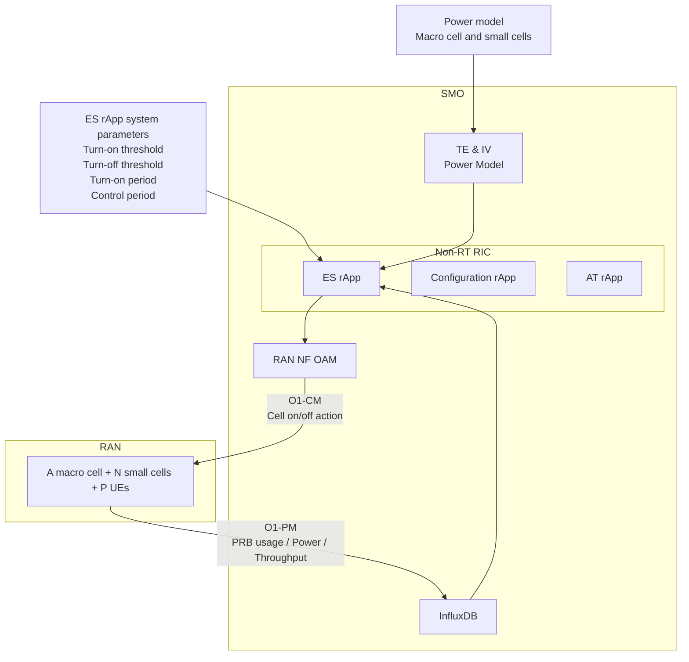

# Research Handover: Cell Switching for Energy Saving in Heterogeneous Small Cell Networks

> **How do we transfer the ES rApp research work from the previous researcher to the next researcher?**

This document describes the research handover workflow for the original **Base Station Switch-Off Strategy with Guaranteed QoS for Energy Saving** work.

The goal of this handover document is to help the next researcher understand the original ES rApp system, reproduce the main experiments, verify the results, and identify possible future research directions.

---

## Why?

Research handover is required to ensure that the original ES rApp work can be understood, reproduced, and continued by the next researcher.

The original work focuses on reducing total power consumption in a heterogeneous small cell network by switching on/off selected small cells while maintaining UE throughput requirements.

Since this work includes system architecture, algorithm design, PRB transfer efficiency modeling, simulation configuration, experiment scripts, result processing, and evaluation methodology, a structured handover document is necessary to avoid knowledge loss.

Research handover is complete only when the next researcher can:

* Understand the original research problem, challenge, and contribution.
* Understand the ES rApp architecture and control flow.
* Understand the MPS cell turn-off algorithm and comparison algorithms.
* Set up the required environment.
* Run the provided experiment scripts.
* Reproduce the three main experiments.
* Verify the reproduced results.
* Identify possible future research directions.

---

## What?

### Research Handover Workflow


Research handover is complete only after the next researcher can independently reproduce the major experimental results and explain the system behavior.

---

## Background: Original Research

The original [README](https://github.com/bmw-ece-ntust/intent-configuration-system/blob/tobby/Data_modeling/Readme.md#cell-switching-for-energy-saving-in-heterogeneous-small-cell-networks) describes a **Cell Switching for Energy Saving in Heterogeneous Small Cell Networks**.

The original research focuses on the energy-saving problem in ultra-dense wireless networks. Since many base stations may remain active even during low-load periods, the system attempts to reduce power consumption by switching off selected small cells.

However, switching off small cells may increase macro cell loading and affect UE throughput. Therefore, the main challenge is deciding which small cells can be switched off while still maintaining QoS.

---

## Original Problem, Challenge, and Contribution

### Problem

Reduce total power consumption in a heterogeneous small cell network by switching on/off small cells without degrading UE throughput requirements.

### Challenge

The original work focuses on two main challenges:

* There are massive possible cell switch-off combinations in heterogeneous small cell networks.
* There is a trade-off between macro cell loading and energy saving.

### Contribution

The original work provides two major contributions:

* A **Max-Power-Saving (MPS)** cell turn-off algorithm to optimize energy saving.
* A **two-threshold cell on/off strategy** considering macro cell loading and energy saving.

---

## Original System Architecture

The original system is based on an O-RAN architecture and includes the following components:

| Component      | Role                                                          |
| -------------- | ------------------------------------------------------------- |
| SMO            | Provides the management and orchestration environment         |
| Non-RT RIC     | Hosts the ES rApp and related rApps                           |
| ES rApp        | Core component that decides cell on/off actions               |
| InfluxDB       | Stores O1-PM metrics such as PRB usage, power, and throughput |
| RAN NF OAM     | Provides O1-PM collection and O1-CM control interface         |
| TE & IV        | Provides topology and power model information                 |
| O1-PM          | Collects performance metrics                                  |
| O1-CM          | Sends cell on/off control commands                            |
| VIAVI RIC TEST | Provides simulation environment and test scenarios            |

### Simplified Architecture



The original ES rApp decision logic can be summarized as:

```text
Power model + PRB usage + Throughput + PRB transfer efficiency
        ↓
ES rApp cell on/off algorithm
        ↓
Small cell switch-off / switch-on decision
```

---

## Original ES rApp Inputs and Outputs

### Inputs

| Input                   | Description                                                          |
| ----------------------- | -------------------------------------------------------------------- |
| `PEE.AvgPower`          | Average power consumption of macro and small cells                   |
| `RRU.PrbUsedDl`         | Downlink PRB usage of macro and small cells                          |
| `DRB.UEThpDl`           | Average downlink throughput                                          |
| Power model             | Used to estimate active and sleep-mode power                         |
| PRB transfer efficiency | Used to estimate macro PRB increase after switching off a small cell |
| `μ_off`                 | Macro PRB threshold for small cell turn-off                          |
| `μ_on`                  | Macro PRB threshold for small cell turn-on                           |
| `δ`                     | Control period                                                       |
| `δ_on`                  | Cell turn-on detection period                                        |

### Outputs

| Output                       | Description                                        |
| ---------------------------- | -------------------------------------------------- |
| Switch-off cell list         | Selected small cells to be switched off            |
| Switch-on cell list          | Selected small cells to be turned on again         |
| Estimated power saving       | Power saving estimated by the algorithm            |
| Actual power saving          | Observed power saving after execution              |
| Throughput result            | Whether UE throughput requirement is maintained    |
| Macro PRB loading            | Whether macro cell loading remains below threshold |
| Result figures and CSV files | Used for experiment analysis and verification      |

---

## A — Original Work Review

This stage focuses on understanding the original ES rApp research.

The original ES rApp is designed to reduce total power consumption by switching off selected small cells. The key constraint is that the macro cell must still be able to handle the offloaded traffic after small cells are switched off.

| Item                  | Description                                                 |
| --------------------- | ----------------------------------------------------------- |
| Main goal             | Reduce power consumption by switching off small cells       |
| Main control target   | Small cell on/off decision                                  |
| Main input            | PRB usage, throughput, power model, PRB transfer efficiency |
| Main output           | Cell on/off action                                          |
| Main constraint       | Macro cell PRB loading should not exceed threshold          |
| Main algorithm        | MPS, Greedy on                                              |
| Comparison algorithms | MPL, MPI, Exhaustive Search                                 |
| Main evaluation       | Power saving, throughput, macro PRB loading                 |

---

## B — Algorithm Review

This stage focuses on understanding the original algorithms.

The original README includes four cell turn-off algorithms:

| Algorithm         | Description                                                                               |
| ----------------- | ----------------------------------------------------------------------------------------- |
| MPS               | Max-Power-Saving priority algorithm; prioritizes cells with larger estimated power saving |
| MPL               | Low small-cell PRB loading priority algorithm                                             |
| MPI               | Low macro PRB increase priority algorithm                                                 |
| Exhaustive Search | Searches all possible switch-off combinations and selects the best feasible result        |

The original README turn-on algorithm:

| Algorithm         | Description                                                                                                                                                        |
| ----------------- | ------------------------------------------------------------------------------------------------------------------------------------------------------------------ |
| Exhaustive Search | Greedy turn on according to the history action table. If there is no history action, it will select the cell with the highest priority metric $\tau_i$ to turn on. |


---

### MPS: Max-Power-Saving Algorithm

MPS is the main proposed cell turn-off algorithm.

The main idea is:

```text
1. Initialize the active small cell set.
2. Calculate the estimated power saving for each active small cell.
3. Remove cells whose estimated power saving is not positive.
4. Sort candidate cells by descending estimated power saving.
5. Select cells one by one if the macro PRB loading remains below μ_off.
6. Return the selected switch-off cell list.
```

The simplified decision rule is:

```text
If:
    P_save_i > 0
and:
    ρ_M + ρ_i^M <= μ_off

Then:
    small cell i can be switched off
```

MPS prioritizes energy saving directly. Therefore, it is the most important algorithm to understand and reproduce.

---

### MPL: Low Small-Cell PRB Loading Priority

MPL prioritizes cells with lower small-cell PRB usage.

The main idea is:

```text
Switch off cells with smaller PRB usage first because they are expected to create less offloading pressure.
```

MPL is useful as a comparison algorithm, but it does not directly maximize power saving.

---

### MPI: Low Macro PRB Increase Priority

MPI prioritizes cells that cause lower macro PRB increase after being switched off.

The main idea is:

```text
Switch off cells that cause the smallest estimated macro PRB increase first.
```

MPI focuses on reducing macro cell loading pressure.

---

### Exhaustive Search

Exhaustive Search checks all possible switch-off combinations and selects the feasible combination with the largest power saving.

It is useful as a theoretical or comparison baseline, but it has higher computational complexity.

---

### Greedy on

Greedy turn on according to the history action table. If there is no history action, it will select the cell with the lowest priority metric $\tau_i$ to turn on.
$\tau_i$: Power increase per PRB tranfer back to the macro cell

```text
History action table + $\tau_i$
```
---

## C — Environment and Code Handover

This stage focuses on setting up the codebase and runtime environment.

### Project Structure

Important files and directories include:

| Path / File                                                        | Purpose                                                            |
| ------------------------------------------------------------------ | ------------------------------------------------------------------ |
| `main.py`                                                          | Main entry point for ES rApp execution                             |
| `config/config.yaml`                                               | Runtime configuration file                                         |
| `Algorithm/strategy.py`                                            | Main implementation of cell on/off strategies                      |
| `Algorithm/config.py`                                              | Loads algorithm and utility parameters                             |
| `Algorithm/utils.py`                                               | Common utility functions                                           |
| `Data_Processing/InterfaceManager/InfluxdbHandler`                 | InfluxDB client wrapper                                            |
| `Data_Processing/InterfaceManager/Neo4jHandler`                    | Neo4j query and schema helper                                      |
| `Data_Processing/InterfaceManager/NetconfHandler`                  | O1 NETCONF session and control interface                           |
| `Data_Processing/InterfaceManager/UserDefineHandler/userDefine.py` | User-defined topology and algorithm parameters                     |
| `Other/VIAVI_config/`                                              | VIAVI RIC TEST simulation configuration files                      |
| `Other/Script/Result_Processing/`                                  | Result plotting and analysis scripts                               |
| `auto_intent_runner.py`                                            | Script for running algorithm and threshold experiments             |
| `auto_throughput_increase_test.py`                                 | Script for collecting PRB transfer efficiency and power model data |
| `requirements.txt`                                                 | Python dependencies                                                |

---

### Minimum Requirements

The original README lists the following requirements:

* L-SMO
* InfluxDB 2.2.0-alpine
* VIAVI RIC TEST 2.6
* Optional Neo4j 2.0.2
* Python virtual environment
* Required Python packages from `requirements.txt`

---

### Basic Setup Flow

```text
1. Clone the repository.
2. Enter the Data_modeling directory.
3. Create and activate the Python virtual environment.
4. Install dependencies from requirements.txt.
5. Configure config/config.yaml.
6. Start required services such as InfluxDB, VIAVI RIC TEST, and optional Neo4j.
7. Run the ES rApp.
8. Execute experiment scripts.
9. Process and verify the results.
```

---

## D — Experiment Reproduction

This stage focuses on reproducing the three major experiments in the original README.

The original README contains three major experiments:

| Experiment   | Original README Name                      | Handover Purpose                                                |
| ------------ | ----------------------------------------- | --------------------------------------------------------------- |
| [Experiment 1](https://github.com/bmw-ece-ntust/intent-configuration-system/blob/tobby/Data_modeling/Readme.md#experiment-1-algorithm-behavior-validation) | Algorithm Behavior Validation             | Reproduce and verify MPS energy-saving baseline                 |
| [Experiment 2](https://github.com/bmw-ece-ntust/intent-configuration-system/blob/tobby/Data_modeling/Readme.md#experiment-2-algorithm-comparison-under-random-loading) | Algorithm Comparison under Random Loading | Reproduce comparison among MPS, MPL, MPI, and Exhaustive Search |
| [Experiment 3](https://github.com/bmw-ece-ntust/intent-configuration-system/blob/tobby/Data_modeling/Readme.md#experiment-3-cell-onoff-strategy-and-thresholds) | Cell On/Off Strategy and Thresholds       | Reproduce threshold-based long-term on/off strategy             |

---

# Reproduction Experiments

## Experiment 1 — MPS Energy-Saving Baseline Validation

The original README names this experiment **Algorithm Behavior Validation**. For handover purposes, this experiment should be treated as the baseline validation of MPS energy-saving capability.

### Purpose

The purpose is to verify whether the proposed MPS algorithm can effectively reduce total power consumption while maintaining UE throughput requirements.

This experiment is the first result that the next researcher should reproduce because it confirms whether the main proposed algorithm works.

### Original Experiment Setting

```text
Mode:
- cell-off-test

UE counts:
- 6, 7, 8, 9, 10, 11, 12, 13

Strategy methods:
- 1, 2, 3, 4

UE throughput:
- 10 Mbps

Scenarios:
- same_area
- random_area
```

### What to Reproduce

The next researcher should reproduce:

* MPS switch-off decisions.
* Power consumption before and after cell switch-off.
* Power saving result.
* UE throughput result.
* Macro cell PRB loading after offloading.
* Estimated result and actual result comparison.

### Evaluation Metrics

| Metric                      | Description                                              |
| --------------------------- | -------------------------------------------------------- |
| Total power consumption     | Check whether MPS reduces overall energy usage           |
| Power saving                | Compare energy saving against baseline                   |
| Macro PRB loading           | Check whether macro cell loading remains below threshold |
| Switched-off cell count     | Check how many small cells are turned off                |
| Estimated vs. actual result | Check whether model estimation matches observed result   |
| Algorithm behavior          | Check whether each algorithm follows its design priority |

### Completion Condition

Experiment 1 is complete when MPS demonstrates measurable power saving while maintaining UE throughput and keeping macro cell PRB loading within the predefined threshold.

---

## Experiment 2 — Algorithm Comparison under Random Loading

This experiment compares different cell turn-off algorithms under random or non-uniform loading.

### Purpose

The purpose is to compare the performance of MPS, MPL, MPI, and Exhaustive Search under heavier and more random traffic scenarios.

This experiment verifies whether MPS still performs well when traffic loading becomes more complex.

### Original Experiment Setting

```text
Mode:
- cell-off-test

UE counts:
- 54, 63, 72, 81, 90, 99, 108, 117

Strategy methods:
- 1, 2, 3, 4
- Some runs only use 1, 2, 4

UE throughput:
- 10 Mbps

Scenarios:
- same_area
- random_area
```

### What to Reproduce

The next researcher should reproduce:

* Algorithm comparison among MPS, MPL, MPI, and Exhaustive Search.
* Power saving under random loading.
* Throughput maintenance under random loading.
* Macro PRB loading under random loading.
* Controlled cell count under random loading.
* Whether MPS is close to Exhaustive Search while having lower complexity.

### Evaluation Metrics

| Metric                  | Description                                              |
| ----------------------- | -------------------------------------------------------- |
| Total power consumption | Compare energy usage among algorithms                    |
| Power saving            | Compare energy-saving capability of each algorithm       |
| Macro PRB loading       | Check whether macro cell remains within threshold        |
| Controlled cell count   | Compare how many cells each algorithm switches off       |
| Runtime / complexity    | Compare practical execution cost if available            |

### Completion Condition

Experiment 2 is complete when the next researcher can reproduce the algorithm comparison results and explain the performance difference among MPS, MPL, MPI, and Exhaustive Search.

---

## Experiment 3 — Cell On/Off Strategy and Thresholds

This experiment evaluates how different turn-on and turn-off thresholds affect the long-term cell on/off strategy.

### Purpose

The purpose is to analyze how `μ_on` and `μ_off` affect power saving, throughput, macro PRB loading, and cell switching behavior over time.

This experiment verifies the two-threshold cell on/off strategy proposed in the original work.

### Original Experiment Setting

```text
Mode:
- algorithm

Simulation time:
- 7200 seconds

Control period:
- 300 seconds

Scenario:
- same_area

Turn-on thresholds:
- 90, 70, 50

Turn-off thresholds:
- 80, 70, 60, 50, 40, 30, 20
```

Threshold combinations include:

```text
90-80, 90-70, 90-60, 90-50, 90-40, 90-30, 90-20
70-60, 70-50, 70-40, 70-30, 70-20
50-40, 50-30, 50-20
```

### What to Reproduce

The next researcher should reproduce:

* Time-series total power consumption.
* Time-series power saving.
* Time-series throughput.
* Time-series macro cell PRB loading.
* Cell on/off actions over time.
* Comparison among different threshold settings.
* Overall analysis CSV results.

### Evaluation Metrics

| Metric                  | Description                                                |
| ----------------------- | ---------------------------------------------------------- |
| Total power consumption | Overall energy usage of the network                        |
| Power saving            | Energy saved compared with baseline                        |
| UE throughput           | Whether QoS is maintained                                  |
| Macro PRB loading       | Whether macro cell loading becomes too high                |
| Cell on/off count       | Whether thresholds cause frequent switching                |
| Threshold sensitivity   | How different `μ_on` / `μ_off` settings affect performance |

### Completion Condition

Experiment 3 is complete when the next researcher can reproduce the threshold comparison results and explain how different `μ_on` / `μ_off` settings affect energy saving and QoS.


## Minimum Reproducible Result

**The Minimum Reproducible Result consists of the key experimental results presented in the original README, especially the three main experiments.**

The next researcher should independently reproduce:

* Experiment 1: Algorithm Behavior Validation / MPS Energy-Saving Baseline Validation
* Experiment 2: Algorithm Comparison under Random Loading
* Experiment 3: Cell On/Off Strategy and Thresholds

### Minimum Reproducible Result Workflow


### Required Evidence

The minimum reproducible result should include:

* Result CSV files.
* Result figures.

### Completion Condition

The minimum reproducible result is complete when the next researcher can independently reproduce the three major experiments and explain the result trends.

---

## Related Scripts

| Script                             | Purpose                                                         |
| ---------------------------------- | --------------------------------------------------------------- |
| `auto_throughput_increase_test.py` | Collect data points for PRB transfer efficiency and power model |
| `auto_intent_runner.py`            | Run cell-off algorithm tests and on/off strategy tests          |
| `plot_target_tput_vs_prb.py`       | Plot and calculate PRB transfer efficiency and power model      |
| `plot_result_charts.py`            | Plot turn-off algorithm results                                 |
| `plot_result_charts_timeserise.py` | Plot turn-on/off time-series strategy results                   |
| `compare_overall_csvs.py`          | Compare overall analysis results of different thresholds        |
| `export_dashboard_data.py`         | Export InfluxDB dashboard data to CSV                           |
| `plot_influxdb_data.py`            | Plot exported InfluxDB data                                     |
| `data_check.py`                    | Check whether result data points are empty                      |
| `offline_strategy_consume_time.py` | Calculate offline strategy execution time                       |

---

## Roles

| Stage                             | Responsible Role                          | Required Output                                     | Completion Condition                                |
| --------------------------------- | ----------------------------------------- | --------------------------------------------------- | --------------------------------------------------- |
| A — Original Work Review          | Previous Researcher / Incoming Researcher | Summary of ES rApp, system model, and research goal | Original system and research problem are understood |
| B — Algorithm Review              | Previous Researcher / Incoming Researcher | Summary of MPS, MPL, MPI, and Exhaustive Search     | Main algorithm behavior is understood               |
| C — Environment and Code Handover | Previous Researcher / Incoming Researcher | Working environment and runnable codebase           | ES rApp can be executed                             |
| D — Experiment Reproduction       | Incoming Researcher                       | Reproduced experiment results                       | Three main experiments can be rerun                 |
| E — Result Verification           | Incoming Researcher / Advisor             | Verification report                                 | Reproduced results are checked and explained        |
| F — Future Work Planning          | Incoming Researcher / Advisor             | Future work list                                    | Next research direction is identified               |

---


## Future Work

After completing the research handover and reproducing the original results, possible future research directions include:

* Extend the system to consider multiple macro cells.
* Include UL/DL-aware traffic and resource modeling.
* Add UE measurement report information to improve cell switch-off decisions.
---